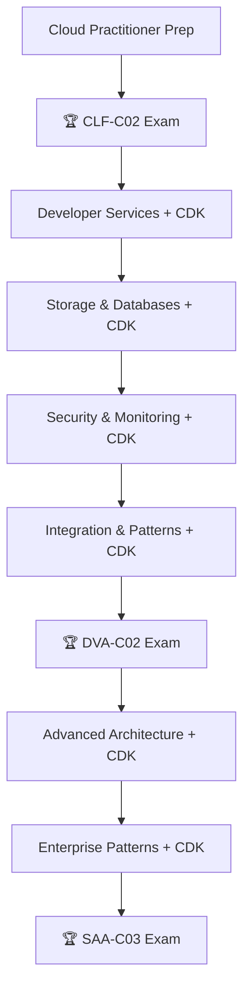

# ☁️ Plan de Estudios - AWS Triple Certificación Path

> **🎯 Objetivo:** Obtener las certificaciones AWS Cloud Practitioner (CLF-C02), Developer Associate (DVA-C02) y Solutions Architect Associate (SAA-C03) en 6-7 meses
>
> **📅 Creado:** 30/07/2025 **🔄 Última actualización:** {{date}}

## 📋 Prerrequisitos Completados

- [x] Experiencia en programación (Go) ✅
- [x] Conocimientos básicos de redes e infraestructura ✅
- [x] Cuenta AWS Free Tier creada ✅
- [x] Entorno de estudio configurado ✅

## [Mapa de Certificaciones de AWS (PDF)](https://d1.awsstatic.com/es_ES/training-and-certification/docs/AWS_certification_paths.pdf)

## 🎯 Estrategia Triple Certificación

### Orden Recomendado:

1. **Cloud Practitioner (CLF-C02)** - Fundamentos teóricos y conceptos generales
2. **Developer Associate (DVA-C02)** - Enfoque técnico en desarrollo y deployment
3. **Solutions Architect Associate (SAA-C03)** - Diseño arquitectónico y patrones avanzados

### 🏗️ Enfoque Infrastructure as Code:

**Toda la infraestructura práctica se generará con AWS CDK en Go**, aplicando:

- Recursos de AWS para laboratorios prácticos (Developer y SA)
- Arquitecturas completas end-to-end
- Pipelines CI/CD automatizados
- Configuraciones de seguridad y monitoreo

---

## 🗺️ Mapa de Ruta General

---

## 📚 Fase 1: Cloud Practitioner Fundamentals (Semanas 1-3)

**⏱️ Tiempo sugerido:** 1-1.5 horas/día **🎯 Enfoque:** Teórico - Conceptos fundamentales de AWS

### 🌐 AWS Global Infrastructure

- [x] [AWS Global Infrastructure](https://www.google.com/search?q=02%2520Conceptos/AWS/Basics/Global%2520Infrastructure.md)

### 🏗️ AWS Well-Architected Framework

- [x] [AWS Well-Architected Framework](https://www.google.com/search?q=02%2520Conceptos/AWS/Basics/Well-Architected%2520Framework.md)

### 🔒 AWS Shared Responsibility Model

- [x] [AWS Shared Responsibility Model](https://www.google.com/search?q=02%2520Conceptos/AWS/Basics/Shared%2520Responsibility%2520Model.md)

### 💰 AWS Pricing and Billing

- [ ] [AWS Pricing Models](https://www.google.com/search?q=02%2520Conceptos/AWS/Basics/Pricing%2520Models.md)
- [ ] [[AWS Support Plans]]
- [ ] [[AWS Cost Explorer]]
- [ ] [[AWS Budgets and Cost Management]]

### ⚙️ Core AWS Services (Conceptual)

#### Compute Services

- [ ] [AWS EC2 - Elastic Compute Cloud](https://www.google.com/search?q=02%2520Conceptos/AWS/Cloud%2520Practicioner/Compute%2520Services/EC2%2520-%2520Elastic%2520Compute%2520Cloud.md)
- [ ] [[AWS Lambda - Serverless Computing]]
- [ ] [[AWS Elastic Beanstalk]]
- [ ] [[Amazon ECS - Elastic Container Service]]
- [ ] [[AWS Fargate]]

#### Storage Services

- [ ] [[Amazon S3 - Simple Storage Service]]
- [ ] [[Amazon EBS - Elastic Block Store]]
- [ ] [[Amazon EFS - Elastic File System]]
- [ ] [[AWS Storage Gateway]]

#### Database Services

- [ ] [[Amazon RDS - Relational Database Service]]
- [ ] [[Amazon DynamoDB]]
- [ ] [[Amazon ElastiCache]]
- [ ] [[Amazon Redshift]]

#### Networking Services

- [ ] [[Amazon VPC - Virtual Private Cloud]]
- [ ] [[Amazon CloudFront]]
- [ ] [[Amazon Route 53]]
- [ ] [[Elastic Load Balancing]]

### 🛡️ Security and Identity Services

- [x] [AWS IAM - Identity and Access Management](https://www.google.com/search?q=02%2520Conceptos/AWS/Cloud%2520Practicioner/Security%2520And%2520identify%2520Services/AWS%2520IAM%2520-%2520Identity%2520and%2520Access%2520Management.md)
- [ ] [[AWS CloudTrail]]
- [ ] [[AWS Config]]
- [ ] [[Amazon Inspector]]
- [ ] [[AWS GuardDuty]]

### 📊 Management and Monitoring

- [ ] [[Amazon CloudWatch]]
- [ ] [[AWS Management Console]]
- [ ] [[AWS Trusted Advisor]]
- [ ] [[AWS Systems Manager]]

### 📖 Recursos de Estudio Cloud Practitioner

**Curso Principal:**

- [ ] [AWS Cloud Practitioner Essentials - AWS Skill Builder](https://aws.amazon.com/training/digital/)
- [ ] [Ultimate AWS Certified Cloud Practitioner CLF-C02](https://www.udemy.com/course/aws-certified-cloud-practitioner-new/)

**Documentación:**

- [ ] [AWS Cloud Practitioner Learning Path](https://aws.amazon.com/training/path-cloudpractitioner/)
- [ ] [AWS Whitepapers - Cloud Fundamentals](https://docs.aws.amazon.com/whitepapers/latest/aws-overview/introduction.html)

**✅ Checkpoint Semana 3:**

- [ ] Comprendo la propuesta de valor de AWS
- [ ] Entiendo el modelo de precios y facturación
- [ ] Conozco los servicios core de cada categoría
- [ ] Puedo explicar casos de uso básicos
- [ ] Domino conceptos de seguridad básicos

---

## 🏆 CLOUD PRACTITIONER EXAM (Semana 4)

**⏱️ Tiempo sugerido:** 2-3 horas/día

### 📝 Exámenes de Práctica Cloud Practitioner

- [ ] AWS Practice Exams (oficiales)
- [ ] Udemy Practice Tests
- [ ] Whizlabs Practice Tests

### 🎯 Resultados Simulacros CLF-C02

- [ ] Simulacro 1: \_\_\_% (Objetivo: \>80%)
- [ ] Simulacro 2: \_\_\_% (Objetivo: \>85%)
- [ ] Simulacro 3: \_\_\_% (Objetivo: \>90%)

**🏆 EXAMEN CLOUD PRACTITIONER (CLF-C02) - Semana 4**

---

## 💻 Fase 2: Developer Associate - Technical Implementation (Semanas 5-10)

**⏱️ Tiempo sugerido:** 2-2.5 horas/día **🎯 Enfoque:** Hands-on + CDK Implementation

### 🛠️ CDK Setup y Fundamentos

- [ ] [[AWS CDK Fundamentals with Go]]
- [ ] [[AWS CLI Advanced Configuration]]

### ⚙️ Advanced Compute Services

#### Serverless Computing Deep Dive

- [ ] [[AWS Lambda Advanced Features]]
- [ ] [[AWS SAM vs CDK]]
- [ ] [[Lambda Layers and Extensions]]
- [ ] [[Lambda Performance Optimization]]

#### Container Services

- [ ] [[Amazon ECS Advanced]]
- [ ] [[AWS Fargate Advanced]]
- [ ] [[Container Image Management]]

#### Load Balancing and Auto Scaling

- [ ] [[Application Load Balancer]]
- [ ] [[Network Load Balancer]]
- [ ] [[Auto Scaling Groups]]
- [ ] [[Target Groups and Health Checks]]

### 🔄 DevOps & CI/CD Services

- [ ] [[AWS CodeCommit]]
- [ ] [[AWS CodeBuild]]
- [ ] [[AWS CodeDeploy]]
- [ ] [[AWS CodePipeline]]
- [ ] [[AWS CodeStar]]

### 🌐 API & Integration Services

- [ ] [[AWS API Gateway]]
- [ ] [[AWS Step Functions]]
- [ ] [[Amazon EventBridge]]
- [ ] [[Amazon SQS]]
- [ ] [[Amazon SNS]]

### 💾 Advanced Storage & Database

- [ ] [[Amazon S3 Advanced Features]]
- [ ] [[Amazon DynamoDB Advanced]]
- [ ] [[DynamoDB Streams]]
- [ ] [[Amazon RDS Advanced]]
- [ ] [[Database Connection Pooling]]

### 🔐 Security & Authentication

- [ ] [[Amazon Cognito]]
- [ ] [[AWS KMS - Key Management Service]]
- [ ] [[AWS Secrets Manager]]
- [ ] [[AWS Parameter Store]]
- [ ] [[AWS WAF]]

### 📊 Monitoring & Debugging

- [ ] [[AWS X-Ray]]
- [ ] [[Amazon CloudWatch Advanced]]
- [ ] [[CloudWatch Logs]]
- [ ] [[Application Performance Monitoring]]

### 🧪 Laboratorios Prácticos Developer (Semanas 5-10)

#### Semana 5: CDK Setup + Serverless

- [ ] [[Lab CDK 01 - Setup AWS CDK con Go]]
- [ ] [[Lab CDK 02 - Lambda + API Gateway Stack]]
- [ ] [[Lab CDK 03 - DynamoDB + Lambda Integration]]

#### Semana 6: Containers + CI/CD

- [ ] [[Lab CDK 04 - ECS Fargate Application]]
- [ ] [[Lab CDK 05 - CodePipeline CI/CD Stack]]
- [ ] [[Lab CDK 06 - Application Load Balancer]]

#### Semana 7: Security + Authentication

- [ ] [[Lab CDK 07 - Cognito Authentication Stack]]
- [ ] [[Lab CDK 08 - KMS + Secrets Manager]]
- [ ] [[Lab CDK 09 - WAF + Security Groups]]

#### Semana 8: Monitoring + Integration

- [ ] [[Lab CDK 10 - X-Ray Tracing Setup]]
- [ ] [[Lab CDK 11 - CloudWatch Dashboard]]
- [ ] [[Lab CDK 12 - SQS + SNS Integration]]

#### Semana 9: Advanced Patterns

- [ ] [[Lab CDK 13 - Event-Driven Architecture]]
- [ ] [[Lab CDK 14 - Microservices Pattern]]
- [ ] [[Lab CDK 15 - Step Functions Workflow]]

#### Semana 10: Review + Practice

- [ ] [[Lab CDK 16 - Full Stack Application]]
- [ ] [[Lab CDK 17 - Performance Optimization]]
- [ ] [[Lab CDK 18 - Cost Optimization]]

**✅ Checkpoint Semana 10:**

- [ ] Domino desarrollo serverless en AWS
- [ ] Puedo implementar CI/CD completo
- [ ] Manejo autenticación y autorización
- [ ] Implemento monitoreo y debugging
- [ ] Uso CDK Go para infraestructura compleja

---

## 🏆 DEVELOPER ASSOCIATE EXAM (Semana 11)

**⏱️ Tiempo sugerido:** 3-4 horas/día

### 📚 Repaso Final Developer

- [ ] [[AWS Developer Services Cheat Sheet]]
- [ ] [[Lambda Best Practices]]
- [ ] [[DynamoDB Patterns]]
- [ ] [[API Gateway Troubleshooting]]
- [ ] [[X-Ray Debugging Scenarios]]

### 🎯 Resultados Simulacros DVA-C02

- [ ] Simulacro 1: \_\_\_% (Objetivo: \>75%)
- [ ] Simulacro 2: \_\_\_% (Objetivo: \>80%)
- [ ] Simulacro 3: \_\_\_% (Objetivo: \>85%)

**🏆 EXAMEN DEVELOPER ASSOCIATE (DVA-C02) - Semana 11**

---

## 🏗️ Fase 3: Solutions Architect - Advanced Architecture (Semanas 12-17)

**⏱️ Tiempo sugerido:** 2.5-3 horas/día **🎯 Enfoque:** Arquitectural Patterns + Enterprise Solutions

### 🌐 Advanced Networking

- [ ] [[VPC Advanced Patterns]]
- [ ] [[AWS Direct Connect]]
- [ ] [[VPC Peering and Transit Gateway]]
- [ ] [[AWS PrivateLink]]
- [ ] [[Network Load Balancer Advanced]]

### 🗃️ Enterprise Database Solutions

- [ ] [[Amazon Aurora]]
- [ ] [[Amazon DocumentDB]]
- [ ] [[Database Migration Service]]
- [ ] [[Database Backup and Recovery]]
- [ ] [[Read Replicas and Clustering]]

### 🚀 High Availability & Disaster Recovery

- [ ] [[Multi-AZ Deployments]]
- [ ] [[Multi-Region Architecture]]
- [ ] [[Disaster Recovery Strategies]]
- [ ] [[Backup and Archive Solutions]]
- [ ] [[Cross-Region Replication]]

### 📊 Analytics & Big Data

- [ ] [[Amazon Kinesis]]
- [ ] [[AWS Glue]]
- [ ] [[Amazon EMR]]
- [ ] [[Amazon Athena]]
- [ ] [[AWS Lake Formation]]

### 🏢 Enterprise Services

- [ ] [[AWS Organizations]]
- [ ] [[AWS Control Tower]]
- [ ] [[AWS Service Catalog]]
- [ ] [[AWS Config Advanced]]
- [ ] [[AWS CloudFormation StackSets]]

### 💰 Cost Optimization & Governance

- [ ] [[AWS Cost Optimization Strategies]]
- [ ] [[Reserved Instances and Savings Plans]]
- [ ] [[Spot Instances Patterns]]
- [ ] [[Resource Tagging Strategies]]
- [ ] [[AWS Well-Architected Cost Optimization]]

### 🏗️ Architectural Patterns

- [ ] [[3-Tier Web Architecture]]
- [ ] [[Microservices Architecture]]
- [ ] [[Event-Driven Architecture]]
- [ ] [[Serverless Architecture Patterns]]
- [ ] [[Hybrid Cloud Architecture]]

### 🔒 Advanced Security

- [ ] [[AWS Security Hub]]
- [ ] [[AWS Shield and WAF Advanced]]
- [ ] [[Network Security Patterns]]
- [ ] [[Data Encryption Strategies]]
- [ ] [[Compliance and Governance]]

### 🧪 Laboratorios Architecture (Semanas 12-17)

#### Semana 12: Advanced Networking

- [ ] [[Lab CDK 19 - Multi-VPC Architecture]]
- [ ] [[Lab CDK 20 - Transit Gateway Implementation]]
- [ ] [[Lab CDK 21 - CloudFront + WAF]]

#### Semana 13: Enterprise Databases

- [ ] [[Lab CDK 22 - Aurora Multi-AZ Setup]]
- [ ] [[Lab CDK 23 - Read Replicas Pattern]]
- [ ] [[Lab CDK 24 - Database Migration]]

#### Semana 14: High Availability

- [ ] [[Lab CDK 25 - Multi-Region Active-Passive]]
- [ ] [[Lab CDK 26 - Auto Scaling Policies]]
- [ ] [[Lab CDK 27 - Health Checks + Route 53]]

#### Semana 15: Analytics & Big Data

- [ ] [[Lab CDK 28 - Kinesis Data Pipeline]]
- [ ] [[Lab CDK 29 - Real-time Analytics]]
- [ ] [[Lab CDK 30 - Data Lake Architecture]]

#### Semana 16: Enterprise Patterns

- [ ] [[Lab CDK 31 - Organizations Setup]]
- [ ] [[Lab CDK 32 - Cost Optimization Stack]]
- [ ] [[Lab CDK 33 - Compliance Automation]]

#### Semana 17: Capstone Projects

- [ ] [[Lab CDK 34 - Enterprise E-commerce Platform]]
- [ ] [[Lab CDK 35 - SaaS Multi-Tenant Architecture]]
- [ ] [[Lab CDK 36 - Complete DR Solution]]

**✅ Checkpoint Semana 17:**

- [ ] Diseño arquitecturas enterprise-grade
- [ ] Implemento alta disponibilidad y DR
- [ ] Manejo costos y governance
- [ ] Comprendo patrones arquitectónicos avanzados

---

## 🏆 SOLUTIONS ARCHITECT EXAM (Semana 18)

**⏱️ Tiempo sugerido:** 3-4 horas/día

### 📚 Repaso Final Solutions Architect

- [ ] [[AWS Services Comparison Matrix]]
- [ ] [[Common Exam Scenarios]]
- [ ] [[Cost Calculation Framework]]
- [ ] [[Security Best Practices Checklist]]
- [ ] [[Troubleshooting Decision Trees]]
- [ ] [[Well-Architected Framework Deep Dive]]

### 🎯 Resultados Simulacros SAA-C03

- [ ] Simulacro 1: \_\_\_% (Objetivo: \>75%)
- [ ] Simulacro 2: \_\_\_% (Objetivo: \>80%)
- [ ] Simulacro 3: \_\_\_% (Objetivo: \>85%)

### ✅ Checklist Final Pre-Examen

- [ ] Domino los 6 pilares del Well-Architected Framework
- [ ] Puedo calcular costos y ROI
- [ ] Conozco límites y quotas de todos los servicios
- [ ] Puedo diseñar para cualquier caso de uso
- [ ] Manejo troubleshooting avanzado
- [ ] Promedio \>85% en simulacros

**🏆 EXAMEN SOLUTIONS ARCHITECT ASSOCIATE (SAA-C03) - Semana 18**

---

## 📅 Cronograma Detallado Triple Certificación

| Semana | Fase                    | Tiempo/día | Enfoque Principal       | Deliverable             |
| ------ | ----------------------- | ---------- | ----------------------- | ----------------------- |
| 1-3    | Cloud Practitioner Prep | 1-1.5h     | Teoría fundamental AWS  | Conceptos sólidos       |
| 4      | CLF-C02 Exam            | 2-3h       | Repaso + Examen         | **CLF-C02 Certificate** |
| 5-10   | Developer Technical     | 2-2.5h     | Hands-on + CDK Go       | CDK Stacks completos    |
| 11     | DVA-C02 Exam            | 3-4h       | Repaso + Examen         | **DVA-C02 Certificate** |
| 12-17  | Solutions Architect     | 2.5-3h     | Enterprise Architecture | Architecture Patterns   |
| 18     | SAA-C03 Exam            | 3-4h       | Repaso + Examen         | **SAA-C03 Certificate** |

---

## 🛠️ Herramientas y Recursos

### 📚 Plataformas de Estudio

- [ ] AWS Free Tier account configurada
- [ ] AWS Skill Builder account
- [ ] Udemy/A Cloud Guru subscriptions
- [ ] Whizlabs practice exams

### 🏗️ CDK Development Environment

- [ ] **Go 1.21+** instalado
- [ ] **AWS CDK v2** instalado
- [ ] **AWS CLI v2** configurado
- [ ] **VS Code/GoLand** con AWS extensions

### 📊 Progress Tracking

- [ ] Obsidian vault configurado
- [ ] Practice exam scores tracking
- [ ] CDK projects repository
- [ ] Weekly review schedule

---

## 🎯 Métricas de Éxito

### 🏆 Certificaciones Meta

- [ ] **AWS Cloud Practitioner (CLF-C02)** - Semana 4
- [ ] **AWS Developer Associate (DVA-C02)** - Semana 11
- [ ] **AWS Solutions Architect Associate (SAA-C03)** - Semana 18

### 📈 Objetivos por Mes

- [ ] **Mes 1:** CLF-C02 + Developer foundations
- [ ] **Mes 2:** Technical implementation + CDK mastery
- [ ] **Mes 3:** DVA-C02 + Architecture foundations
- [ ] **Mes 4-5:** Enterprise patterns + SAA-C03

---

## 📚 Enlaces de Referencia

- [AWS Certification Paths](https://aws.amazon.com/certification/)
- [AWS Well-Architected Framework](https://aws.amazon.com/architecture/well-architected/)
- [AWS CDK Go Documentation](https://docs.aws.amazon.com/cdk/v2/guide/work-with-cdk-go.html)
- [AWS Architecture Center](https://aws.amazon.com/architecture/)
- [AWS Free Tier](https://aws.amazon.com/free/)

---

> **💡 Estrategia:** Enfoque progresivo desde fundamentos teóricos hasta implementación enterprise, con práctica hands-on intensiva usando CDK Go para maximizar el aprendizaje práctico.

**🔄 Próxima revisión:** Semanal **📝 Estado:** Ready for Triple Certification Journey
