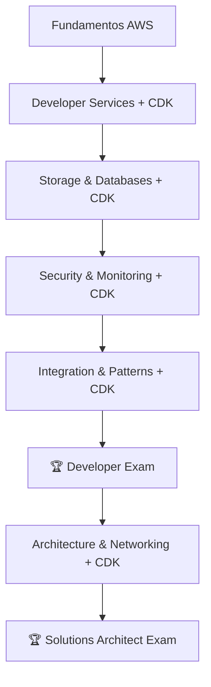

# ☁️ Plan de Estudios - AWS Developer & Solutions Architect Associate

> **🎯 Objetivo:** Obtener AMBAS certificaciones AWS Developer Associate (DVA-C02) y Solutions Architect Associate (SAA-C03) en 4-5 meses **📅 Creado:** 27/06/2025 **🔄 Última actualización:** {{date}}

## 📋 Prerrequisitos Completados

- [x] Experiencia en programación (Go) ✅
- [x] Conocimientos básicos de redes e infraestructura ✅
- [x] Cuenta AWS Free Tier creada ✅
- [x] Entorno de estudio configurado ✅

## [Mapa de Certificaciones de AWS (PDF)](https://d1.awsstatic.com/es_ES/training-and-certification/docs/AWS_certification_paths.pdf)

## 🎯 Estrategia Dual: Developer + Solutions Architect

### Orden Recomendado:

1. **Developer Associate primero** (más técnico, base sólida)
2. **Solutions Architect después** (arquitectura y diseño)

### 🏗️ Enfoque Infrastructure as Code:

**Toda la infraestructura se generará con AWS CDK en Go**, incluyendo:

- Recursos de AWS para laboratorios prácticos
- Arquitecturas completas end-to-end
- Pipelines CI/CD automatizados
- Configuraciones de seguridad y monitoreo

---

## 🗺️ Mapa de Ruta General



---

## 📚 Fase 1: Fundamentos AWS (Semanas 1-2)

**⏱️ Tiempo sugerido:** 1-2 horas/día

### 🎯 Conceptos Clave a Dominar

- [x] [[AWS Global Infrastructure]] ✅
- [x] [[AWS Well-Architected Framework]] ✅
- [x] [[AWS Shared Responsibility Model]] ✅
- [ ] [[AWS Management Console]]
- [ ] [[AWS Pricing Models]]
- [ ] [[AWS CDK Fundamentals with Go]]

### ⚙️ Servicios Core

- [x] [[AWS IAM & AWS CLI - Identity and Access Management]] ✅
- [ ] [[Amazon EC2 - Elastic Compute Cloud]]
- [ ] [[Amazon S3 - Simple Storage Service]]
- [ ] [[Amazon VPC - Virtual Private Cloud]]

### 📖 Recursos de Estudio

**Curso Principal** (elegir uno):

- [ ] [Ultimate AWS Certified Developer Associate](https://www.udemy.com/course/aws-certified-developer-associate-dva-c01/)
- [ ] [Ultimate AWS Certified Solutions Architect Associate](https://www.udemy.com/course/aws-certified-solutions-architect-associate-saa-c03/?couponCode=LETSLEARNNOW)

**Documentación:**

- [ ] [AWS Documentation - Getting Started](https://docs.aws.amazon.com/index.html)
- [ ] [AWS CDK for Go Developer Guide](https://docs.aws.amazon.com/cdk/v2/guide/work-with-cdk-go.html)

### 🧪 Laboratorios Prácticos - Semana 1

- [ ] [[Lab 01 - Crear primera instancia EC2]]
- [ ] [[Lab 02 - Configurar bucket S3 básico]]
- [ ] [[Lab 03 - Gestión básica de usuarios IAM]]
- [ ] [[Lab CDK 01 - Setup AWS CDK con Go]]

### 🧪 Laboratorios Prácticos - Semana 2

- [ ] [[Lab 04 - Configurar VPC básica con subnets]]
- [ ] [[Lab 05 - Políticas de seguridad S3]]
- [ ] [[Lab 06 - Security Groups y NACLs]]
- [ ] [[Lab CDK 02 - VPC y EC2 con CDK Go]]

**✅ Checkpoint Semana 2:**

- [ ] Puedo explicar la infraestructura global de AWS
- [ ] Entiendo el modelo de responsabilidad compartida
- [ ] Puedo crear y gestionar recursos básicos
- [ ] Comprendo conceptos de facturación
- [ ] Tengo configurado AWS CDK con Go

---

## 💻 Fase 2: Developer Services + CDK (Semanas 3-4)

**⏱️ Tiempo sugerido:** 1.5-2 horas/día

### ⚙️ Servicios de Compute

- [ ] [[Amazon EC2 Advanced - Auto Scaling y Load Balancers]]
- [ ] [[AWS Lambda - Serverless Computing]]
- [ ] [[Amazon ECS - Elastic Container Service]]
- [ ] [[AWS Elastic Beanstalk - Platform as a Service]]
- [ ] [[AWS Fargate - Serverless Containers]]

### ⚙️ DevOps & CI/CD

- [ ] [[AWS CodeCommit - Source Control]]
- [ ] [[AWS CodeBuild - Build Service]]
- [ ] [[AWS CodeDeploy - Deployment Service]]
- [ ] [[AWS CodePipeline - CI/CD Pipeline]]
- [ ] [[AWS SAM vs CDK - Serverless Deployment]]

### ⚙️ API & Integration

- [ ] [[AWS API Gateway - REST/HTTP APIs]]
- [ ] [[AWS Step Functions - Workflow Orchestration]]

### 💾 Servicios de Storage

- [ ] [[Amazon EBS - Elastic Block Store]]
- [ ] [[Amazon EFS - Elastic File System]]
- [ ] [[AWS Storage Gateway]]
- [ ] [[Amazon S3 Advanced Features]]

### 🧪 Laboratorios Prácticos - Semana 3

- [ ] [[Lab 07 - Desplegar Spring Boot en Elastic Beanstalk]]
- [ ] [[Lab 08 - Configurar Auto Scaling Group]]
- [ ] [[Lab 09 - Crear función Lambda básica]]
- [ ] [[Lab CDK 03 - Lambda + API Gateway con CDK Go]]

### 🧪 Laboratorios Prácticos - Semana 4

- [ ] [[Lab 10 - Application Load Balancer]]
- [ ] [[Lab 11 - Contenedores con ECS]]
- [ ] [[Lab 12 - Integración Lambda con API Gateway]]
- [ ] [[Lab CDK 04 - CI/CD Pipeline con CDK Go]]

### 🔗 Conexión con Java/Spring Boot + CDK

- [ ] [[Deploying Java Apps on AWS]]
- [ ] [[Spring Boot + AWS Lambda]]
- [ ] [[Containerización con ECS]]
- [ ] [[Spring Boot + Elastic Beanstalk Best Practices]]
- [ ] [[CDK Go Patterns for Java Applications]]

**✅ Checkpoint Semana 4:**

- [ ] Puedo diseñar soluciones de compute escalables
- [ ] Entiendo cuándo usar cada servicio de storage
- [ ] Puedo desplegar aplicaciones Java en AWS
- [ ] Comprendo conceptos de containerización
- [ ] Manejo CDK Go para infraestructura como código

---

## 🗄️ Fase 3: Storage, Databases & Networking + CDK (Semanas 5-6)

**⏱️ Tiempo sugerido:** 1.5-2 horas/día

### 🗃️ Servicios de Base de Datos

- [ ] [[Amazon RDS - Relational Database Service]]
- [ ] [[Amazon DynamoDB - NoSQL Database]]
- [ ] [[Amazon ElastiCache - In-memory Caching]]
- [ ] [[Amazon Redshift - Data Warehouse]]
- [ ] [[Amazon Aurora - MySQL/PostgreSQL Compatible]]
- [ ] [[Amazon DocumentDB - MongoDB Compatible]]

### 🌐 Networking Avanzado

- [ ] [[VPC Advanced - NAT Gateways y VPC Endpoints]]
- [ ] [[Amazon Route 53 - DNS Service]]
- [ ] [[AWS CloudFront - CDN]]
- [ ] [[AWS Direct Connect]]
- [ ] [[VPC Peering y Transit Gateway]]

### 🧪 Laboratorios Prácticos - Semana 5

- [ ] [[Lab 13 - Conectar Java App con RDS PostgreSQL]]
- [ ] [[Lab 14 - Configurar ElastiCache para Spring Boot]]
- [ ] [[Lab 15 - DynamoDB con aplicación Java]]
- [ ] [[Lab CDK 05 - RDS Multi-AZ con CDK Go]]

### 🧪 Laboratorios Prácticos - Semana 6

- [ ] [[Lab 16 - Arquitectura Multi-AZ]]
- [ ] [[Lab 17 - CloudFront para contenido estático]]
- [ ] [[Lab 18 - Route 53 con health checks]]
- [ ] [[Lab CDK 06 - CloudFront + S3 con CDK Go]]

**✅ Checkpoint Semana 6:**

- [ ] Puedo diseñar soluciones de base de datos apropiadas
- [ ] Entiendo networking avanzado en AWS
- [ ] Puedo implementar alta disponibilidad
- [ ] Comprendo optimización de performance
- [ ] Uso CDK Go para infraestructura de datos y networking

---

## 🔒 Fase 4: Security, Authentication & Monitoring + CDK (Semanas 7-8)

**⏱️ Tiempo sugerido:** 1-2 horas/día

### 🛡️ Servicios de Seguridad

- [ ] [[AWS IAM Advanced - Roles, Policies, Federation]]
- [ ] [[AWS KMS - Key Management Service]]
- [ ] [[AWS Secrets Manager]]
- [ ] [[AWS WAF - Web Application Firewall]]
- [ ] [[Amazon Inspector]]
- [ ] [[AWS GuardDuty]]

### 👤 Authentication & Authorization

- [ ] [[Amazon Cognito - User Authentication]]
    - Cognito User Pools
    - Cognito Identity Pools
    - Cognito Hosted UI
- [ ] [[AWS STS - Security Token Service]]

### 📊 Monitoring y Logging

- [ ] [[Amazon CloudWatch - Monitoring y Logs]]
- [ ] [[AWS CloudTrail - API Logging]]
- [ ] [[AWS Config - Configuration Management]]
- [ ] [[AWS Systems Manager]]
- [ ] [[AWS X-Ray - Distributed Tracing]]

### 🧪 Laboratorios Prácticos - Semana 7

- [ ] [[Lab 19 - Monitoreo avanzado aplicación Java]]
- [ ] [[Lab 20 - Logging centralizado con CloudWatch]]
- [ ] [[Lab 21 - Gestión de secretos con Secrets Manager]]
- [ ] [[Lab CDK 07 - Cognito Authentication con CDK Go]]

### 🧪 Laboratorios Prácticos - Semana 8

- [ ] [[Lab 22 - Configurar alertas CloudWatch]]
- [ ] [[Lab 23 - WAF para proteger aplicación web]]
- [ ] [[Lab 24 - Compliance con AWS Config]]
- [ ] [[Lab CDK 08 - Security Stack completo con CDK Go]]

**✅ Checkpoint Semana 8:**

- [ ] Puedo implementar seguridad en profundidad
- [ ] Entiendo compliance y governance
- [ ] Puedo configurar monitoreo completo
- [ ] Comprendo incident response
- [ ] Manejo autenticación con Cognito via CDK Go

---

## 🔗 Fase 5: Integration, Messaging & Patterns + CDK (Semanas 9-10)

**⏱️ Tiempo sugerido:** 2 horas/día

### 🏗️ Patrones Arquitectónicos

- [ ] [[3-Tier Web Architecture]]
- [ ] [[Microservices on AWS]]
- [ ] [[Event-Driven Architecture]]
- [ ] [[Disaster Recovery Patterns]]
- [ ] [[Serverless Architectures]]

### 🔗 Servicios de Integración

- [ ] [[Amazon SQS - Simple Queue Service]]
- [ ] [[Amazon SNS - Simple Notification Service]]
- [ ] [[AWS API Gateway]]
- [ ] [[AWS Step Functions]]
- [ ] [[Amazon EventBridge]]
- [ ] [[Amazon Kinesis - Real-time Streaming]]

### 💼 Casos de Uso para Backend Developer

- [ ] [[Migrating Monolith to AWS]]
- [ ] [[Implementing CI-CD with AWS]]
- [ ] [[Scaling Java Applications]]
- [ ] [[Cost Optimization Strategies]]

### 🧪 Proyectos Prácticos

- [ ] [[Proyecto 01 - Migrar aplicación monolítica]]
- [ ] [[Proyecto 02 - Implementar arquitectura de microservicios]]
- [ ] [[Proyecto 03 - Sistema de procesamiento de eventos]]
- [ ] [[Lab CDK 09 - Event-Driven Architecture con CDK Go]]
- [ ] [[Lab CDK 10 - Microservices completos con CDK Go]]

**✅ Checkpoint Semana 10:**

- [ ] Puedo diseñar arquitecturas complejas
- [ ] Entiendo trade-offs arquitectónicos
- [ ] Puedo calcular costos aproximados
- [ ] Comprendo patrones de disaster recovery
- [ ] Implemento arquitecturas completas con CDK Go

---

## 🏆 DEVELOPER ASSOCIATE EXAM (Semanas 11-12)

**⏱️ Tiempo sugerido:** 2-3 horas/día

### 📝 Exámenes de Práctica

- [ ] AWS Practice Exams (oficiales)
- [ ] Udemy Practice Tests (Stephane Maarek)
- [ ] Whizlabs Practice Tests
- [ ] Tutorials Dojo Practice Tests

### 📚 Repaso Final Developer

- [ ] [[AWS Developer Services Cheat Sheet]]
- [ ] [[Lambda Best Practices]]
- [ ] [[DynamoDB Patterns]]
- [ ] [[API Gateway Troubleshooting]]
- [ ] [[X-Ray Debugging Scenarios]]

### 🎯 Resultados Simulacros Developer

- [ ] Simulacro 1: ___% (Objetivo: >75%)
- [ ] Simulacro 2: ___% (Objetivo: >80%)
- [ ] Simulacro 3: ___% (Objetivo: >85%)

**🏆 EXAMEN DEVELOPER ASSOCIATE - Semana 12**

---

## 🏗️ Fase 6: Architecture & Advanced Networking + CDK (Semanas 13-14)

**⏱️ Tiempo sugerido:** 2 horas/día

### ⚖️ Load Balancing & Auto Scaling

- [ ] [[Application Load Balancer Advanced]]
- [ ] [[Network Load Balancer]]
- [ ] [[Auto Scaling Groups Advanced]]
- [ ] [[Elastic Load Balancing Patterns]]

### 🌐 Advanced Networking & CDN

- [ ] [[VPC Advanced Patterns]]
- [ ] [[CloudFront Advanced Features]]
- [ ] [[Route 53 Advanced Routing]]
- [ ] [[Direct Connect & VPN]]

### 💰 Cost Optimization & Governance

- [ ] [[AWS Cost Explorer]]
- [ ] [[AWS Budgets]]
- [ ] [[Reserved Instances & Spot]]
- [ ] [[AWS Organizations]]
- [ ] [[AWS Trusted Advisor]]

### 🧪 Laboratorios Architecture Focus

- [ ] [[Lab CDK 11 - Multi-Region Architecture con CDK Go]]
- [ ] [[Lab CDK 12 - Cost-Optimized Infrastructure con CDK Go]]

**✅ Checkpoint Semana 14:**

- [ ] Puedo diseñar arquitecturas enterprise-grade
- [ ] Entiendo optimización de costos
- [ ] Manejo networking avanzado
- [ ] Comprendo governance y compliance

---

## 🏆 SOLUTIONS ARCHITECT EXAM (Semanas 15-16)

**⏱️ Tiempo sugerido:** 2-3 horas/día

### 📚 Repaso Final Solutions Architect

- [ ] [[AWS Services Cheat Sheet]]
- [ ] [[Common Exam Scenarios]]
- [ ] [[Cost Calculation Examples]]
- [ ] [[Security Best Practices Summary]]
- [ ] [[Troubleshooting Common Issues]]
- [ ] [[Well-Architected Framework Review]]

### 🎯 Resultados Simulacros SA

- [ ] Simulacro 1: ___% (Objetivo: >75%)
- [ ] Simulacro 2: ___% (Objetivo: >80%)
- [ ] Simulacro 3: ___% (Objetivo: >85%)

### ✅ Checklist Final Pre-Examen

- [ ] Domino los 5 pilares del Well-Architected Framework
- [ ] Puedo diseñar arquitecturas multi-tier
- [ ] Entiendo pricing y cost optimization
- [ ] Conozco límites y quotas de servicios principales
- [ ] Puedo resolver casos de troubleshooting
- [ ] Promedio >85% en exámenes de práctica
- [ ] Repasé scenarios de disaster recovery
- [ ] Tengo clara la diferencia entre servicios similares

**🏆 EXAMEN SOLUTIONS ARCHITECT ASSOCIATE - Semana 16**

---

## 📅 Cronograma Detallado con CDK

|Semana|Fase|Tiempo/día|Enfoque Principal|Deliverable CDK|
|---|---|---|---|---|
|1-2|Fundamentos|1-2h|Teoría + Labs básicos + Setup CDK|CDK Go configurado|
|3-4|Developer Services|1.5-2h|Serverless + CI/CD + CDK|Lambda + API Gateway Stack|
|5-6|Storage/DB/Networking|1.5-2h|Integración datos + CDK|RDS + VPC Stack completo|
|7-8|Security/Monitoring|1-2h|Cognito + Seguridad + CDK|Security Stack con Cognito|
|9-10|Integration/Patterns|2h|Arquitecturas + CDK|Event-Driven Stack|
|11-12|Developer Exam Prep|2-3h|Repaso + Examen|**DVA-C02 Certificación**|
|13-14|Architecture Advanced|2h|Networking + Cost + CDK|Enterprise Architecture Stack|
|15-16|SA Exam Prep|2-3h|Repaso + Examen|**SAA-C03 Certificación**|

---

## 🛠️ Herramientas y Recursos

### 📚 Plataformas de Estudio

- [ ] AWS Free Tier account configurada
- [ ] Udemy/A Cloud Guru subscription activa
- [ ] AWS Documentation bookmarked
- [ ] AWS Whitepapers descargados

### 🏗️ CDK Development Environment

- [ ] **Go 1.19+** instalado
- [ ] **AWS CDK v2** instalado
- [ ] **AWS CLI v2** configurado
- [ ] **IDE** con AWS extensions (VS Code/GoLand)
- [ ] **Git repository** para CDK stacks

### 🧪 Labs y Práctica

- [ ] AWS Hands-on Labs
- [ ] Qwiklabs access
- [ ] Cloud Academy Labs
- [ ] **CDK Go Examples Repository** creado

### 👥 Comunidad

- [ ] AWS Community Builders
- [ ] Reddit r/AWSCertifications joined
- [ ] **AWS CDK Slack** community
- [ ] Discord/Slack AWS groups
- [ ] LinkedIn AWS groups seguidos

---

## 🎯 Roadmap Post-Certificación

### 📈 Próximos Pasos

- [ ] [[AWS DevOps Engineer Preparation]]
- [ ] [[Kubernetes CKA Preparation]]
- [ ] [[Advanced AWS Architectures]]
- [ ] [[Terraform vs CDK Comparison]]

### 💼 Aplicación Práctica

- [ ] Migrar proyecto personal a AWS con CDK Go
- [ ] Implementar CI/CD pipeline completo
- [ ] Documentar arquitecturas en Obsidian
- [ ] **Open Source CDK Go constructs**
- [ ] Compartir conocimiento (blog/GitHub)
- [ ] Contribuir a proyectos open source

---

## 📊 Tracking de Progreso

### 🏆 Certificaciones Objetivo

- [ ] **AWS Certified Developer Associate (DVA-C02)** - Meta: Semana 12
- [ ] **AWS Certified Solutions Architect Associate (SAA-C03)** - Meta: Semana 16

### 📈 Métricas Semanales

```
Semana 1: ___% completado    Semana 9: ___% completado
Semana 2: ___% completado    Semana 10: ___% completado
Semana 3: ___% completado    Semana 11: ___% completado
Semana 4: ___% completado    Semana 12: DVA EXAM
Semana 5: ___% completado    Semana 13: ___% completado
Semana 6: ___% completado    Semana 14: ___% completado
Semana 7: ___% completado    Semana 15: ___% completado
Semana 8: ___% completado    Semana 16: SAA EXAM
```

### 🎯 Objetivos Clave

- [ ] **Mes 1:** Fundamentos sólidos + CDK setup + primeros labs
- [ ] **Mes 2:** Servicios developer + Storage/DB + CDK stacks
- [ ] **Mes 3:** Security + Integration + **Developer Exam**
- [ ] **Mes 4:** Architecture avanzada + **Solutions Architect Exam**

---

## 📚 Enlaces Útiles

- [AWS Certification Roadmap](https://aws.amazon.com/certification/)
- [AWS Well-Architected Tool](https://aws.amazon.com/well-architected-tool/)
- [AWS Architecture Center](https://aws.amazon.com/architecture/)
- [AWS CDK Go Documentation](https://docs.aws.amazon.com/cdk/v2/guide/work-with-cdk-go.html)
- [AWS CDK Patterns](https://cdkpatterns.com/)
- [AWS Free Tier](https://aws.amazon.com/free/)
- [AWS Training and Certification](https://aws.amazon.com/training/)

---

> **💡 Nota:** Este plan está optimizado para desarrolladores backend con experiencia en Java/Spring Boot, usando AWS CDK con Go para Infrastructure as Code. Ajusta los tiempos según tu disponibilidad y ritmo de aprendizaje.

**🔄 Próxima revisión:** {{date+7d}} **📝 Estado actual:** Listo para CDK + Dual Certification