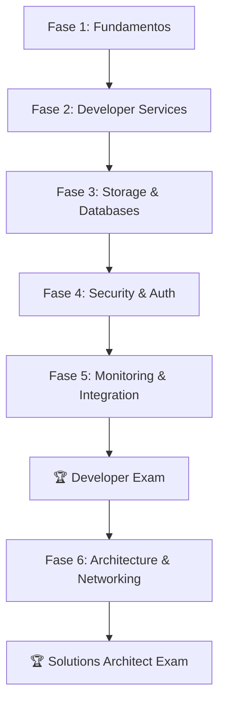

# ☁️ Plan de Estudios - AWS Developer & Solutions Architect Associate

> **🎯 Objetivo:** Obtener AMBAS certificaciones AWS Developer Associate (DVA-C02) y Solutions Architect Associate (SAA-C03) en 4-5 meses **📅 Creado:** 27/06/2025 **🔄 Última actualización:** {{date}}

## 📋 Prerrequisitos Completados

- [x] Experiencia en programación (Java/Spring Boot) ✅
- [x] Conocimientos básicos de redes e infraestructura ✅
- [x] Cuenta AWS Free Tier creada ✅
- [x] Entorno de estudio configurado ✅

## 🎯 Estrategia Dual: Developer + Solutions Architect

### Orden Recomendado:

1. **Developer Associate primero** (más técnico, base sólida)
2. **Solutions Architect después** (arquitectura y diseño)

---

## 🗺️ Mapa de Ruta por Fases



---

## 📚 Fase 1: Fundamentos AWS (Semanas 1-2)

**⏱️ Tiempo:** 1.5-2 horas/día | **Enfoque:** Base común para ambas certificaciones

### 🎯 Conceptos Core Completados

- [x] **AWS Global Infrastructure** ✅
- [x] **AWS Well-Architected Framework** ✅
- [x] **AWS Shared Responsibility Model** ✅

### 🎯 Conceptos Core Pendientes

- [ ] AWS Management Console & CLI
- [ ] AWS Pricing & Cost Management
- [ ] AWS Support Plans
- [ ] Resource Tagging Strategies

### ⚙️ Servicios Fundacionales

- [x] **AWS IAM** (Identity and Access Management) ✅
- [ ] **Amazon EC2** (Elastic Compute Cloud)
- [ ] **Amazon S3** (Simple Storage Service)
- [ ] **Amazon VPC** (Virtual Private Cloud) - básico

---

## 💻 Fase 2: Developer Services (Semanas 3-4)

**⏱️ Tiempo:** 2 horas/día | **Enfoque:** Servicios críticos para Developer Associate

### ⚙️ Compute & Serverless

- [ ] **AWS Lambda** (Serverless Functions)
- [ ] **AWS API Gateway** (REST/HTTP APIs)
- [ ] **AWS Elastic Beanstalk** (Platform as a Service)
- [ ] **AWS SAM** (Serverless Application Model)

### ⚙️ DevOps & CI/CD

- [ ] **AWS CodeCommit** (Source Control)
- [ ] **AWS CodeBuild** (Build Service)
- [ ] **AWS CodeDeploy** (Deployment Service)
- [ ] **AWS CodePipeline** (CI/CD Pipeline)
- [ ] **AWS CodeStar** (Project Templates)

### ⚙️ Container Services

- [ ] **Amazon ECS** (Elastic Container Service)
- [ ] **AWS Fargate** (Serverless Containers)

---

## 🗄️ Fase 3: Storage & Databases (Semanas 5-6)

**⏱️ Tiempo:** 2 horas/día | **Enfoque:** Servicios compartidos entre ambas certificaciones

### 💾 Storage Services

- [ ] **Amazon S3 Advanced** (Lifecycle, Versioning, Encryption)
- [ ] **Amazon EBS** (Elastic Block Store)
- [ ] **Amazon EFS** (Elastic File System)
- [ ] **AWS Storage Gateway** (Hybrid Cloud Storage)

### 🗃️ Database Services

- [ ] **Amazon RDS** (Relational Database Service)
- [ ] **Amazon DynamoDB** (NoSQL Database) - crítico para Developer
- [ ] **Amazon ElastiCache** (In-Memory Caching)
- [ ] **Amazon Aurora** (MySQL/PostgreSQL Compatible)
- [ ] **Amazon DocumentDB** (MongoDB Compatible)

---

## 🔒 Fase 4: Security & Authentication (Semana 7)

**⏱️ Tiempo:** 2 horas/día | **Enfoque:** Seguridad y autenticación

### 🛡️ Security Services

- [ ] **AWS KMS** (Key Management Service)
- [ ] **AWS Secrets Manager** (Secrets Management)
- [ ] **AWS Systems Manager Parameter Store** (Configuration)
- [ ] **AWS IAM Advanced** (Roles, Policies, Federation)

### 👤 Authentication & Authorization

- [ ] **Amazon Cognito** (User Authentication & Authorization)
    - Cognito User Pools (Authentication)
    - Cognito Identity Pools (Authorization)
    - Cognito Hosted UI
- [ ] **AWS STS** (Security Token Service)

### 🛡️ Application Security

- [ ] **AWS WAF** (Web Application Firewall)
- [ ] **AWS Shield** (DDoS Protection)
- [ ] **Amazon Inspector** (Security Assessment)

---

## 📊 Fase 5: Monitoring & Integration (Semana 8)

**⏱️ Tiempo:** 2 horas/día | **Enfoque:** Observabilidad y servicios de integración

### 📈 Monitoring & Logging

- [ ] **Amazon CloudWatch** (Monitoring & Metrics)
- [ ] **AWS CloudTrail** (API Auditing)
- [ ] **AWS Config** (Configuration Compliance)
- [ ] **AWS X-Ray** (Distributed Tracing) - crítico para Developer

### 🔗 Integration Services

- [ ] **Amazon SQS** (Simple Queue Service)
- [ ] **Amazon SNS** (Simple Notification Service)
- [ ] **Amazon EventBridge** (Event Bus)
- [ ] **AWS Step Functions** (Workflow Orchestration)
- [ ] **Amazon Kinesis** (Real-time Data Streaming)

---

## 🏆 DEVELOPER ASSOCIATE EXAM (Semanas 9-10)

**⏱️ Tiempo:** 2-3 horas/día | **Enfoque:** Preparación intensiva para DVA-C02

### 📝 Exámenes de Práctica & Repaso Final

- [ ] AWS Official Practice Exam
- [ ] Udemy Practice Tests (Stephane Maarek)
- [ ] Tutorials Dojo DVA-C02 Tests
- [ ] Whizlabs Practice Tests

**🏆 EXAMEN DEVELOPER ASSOCIATE - Semana 10**

---

## 🏗️ Fase 6: Architecture & Advanced Networking (Semanas 11-12)

**⏱️ Tiempo:** 2 horas/día | **Enfoque:** Preparación Solutions Architect

### 🏗️ Architectural Patterns

- [ ] **3-Tier Web Architecture**
- [ ] **Microservices Architecture**
- [ ] **Event-Driven Architecture**
- [ ] **Serverless Architecture Patterns**
- [ ] **Disaster Recovery Strategies** (RPO/RTO)

### ⚖️ Load Balancing & Auto Scaling

- [ ] **Application Load Balancer** (ALB)
- [ ] **Network Load Balancer** (NLB)
- [ ] **Auto Scaling Groups** (ASG)
- [ ] **Elastic Load Balancing** Advanced

### 🌐 Advanced Networking

- [ ] **Amazon VPC Advanced** (NAT Gateway, VPC Endpoints)
- [ ] **Amazon Route 53** (DNS Service)
- [ ] **Amazon CloudFront** (CDN)
- [ ] **AWS Direct Connect** (Dedicated Network)
- [ ] **VPC Peering** & **Transit Gateway**

### 💰 Cost Optimization

- [ ] **AWS Cost Explorer**
- [ ] **AWS Budgets**
- [ ] **Reserved Instances** & **Spot Instances**
- [ ] **AWS Trusted Advisor**

---

## 🏆 SOLUTIONS ARCHITECT EXAM (Semanas 13-14)

**⏱️ Tiempo:** 2-3 horas/día | **Enfoque:** Preparación intensiva para SAA-C03

### 📝 Exámenes de Práctica & Repaso Final

- [ ] AWS Official Practice Exam SAA-C03
- [ ] Udemy Practice Tests (Stephane Maarek)
- [ ] Tutorials Dojo SAA-C03 Tests
- [ ] A Cloud Guru Practice Tests

**🏆 EXAMEN SOLUTIONS ARCHITECT ASSOCIATE - Semana 14**

---

## 📅 Cronograma por Servicios

|Fase|Semanas|Servicios Clave|Certificación Objetivo|
|---|---|---|---|
|**Fase 1**|1-2|IAM✅, EC2, S3, VPC|Base común|
|**Fase 2**|3-4|Lambda, API Gateway, CodePipeline, ECS|Developer|
|**Fase 3**|5-6|S3 Advanced, RDS, DynamoDB, ElastiCache|Ambas|
|**Fase 4**|7|Cognito, KMS, Secrets Manager, WAF|Ambas|
|**Fase 5**|8|CloudWatch, X-Ray, SQS, SNS, EventBridge|Ambas|
|**Examen 1**|9-10|Repaso + **DVA-C02**|**Developer**|
|**Fase 6**|11-12|ALB, ASG, CloudFront, Route 53, Arquitecturas|Solutions Architect|
|**Examen 2**|13-14|Repaso + **SAA-C03**|**Solutions Architect**|

---

## 🎯 Servicios por Nivel de Importancia

### 🔥 Críticos para Developer Associate

- **AWS Lambda** + **API Gateway**
- **DynamoDB**
- **SQS** + **SNS**
- **CodePipeline** (CI/CD)
- **X-Ray** (Debugging)
- **Cognito** (Authentication)

### 🔥 Críticos para Solutions Architect Associate

- **EC2** + **Auto Scaling**
- **RDS** + **Aurora**
- **VPC** + **Security Groups**
- **CloudFront** + **Route 53**
- **S3** + **CloudWatch**
- **Well-Architected Framework**

### 🔄 Servicios Compartidos (Ambas)

- **IAM** ✅
- **S3**
- **RDS**
- **CloudWatch**
- **Cognito**
- **KMS**

---

## 📊 Tracking de Progreso por Fase

### 🏆 Certificaciones Objetivo

- [ ] **AWS Certified Developer Associate (DVA-C02)** - Meta: Semana 10
- [ ] **AWS Certified Solutions Architect Associate (SAA-C03)** - Meta: Semana 14

### 📈 Progreso por Fase

```
Fase 1 (Fundamentos): ___% completado
Fase 2 (Developer Services): ___% completado  
Fase 3 (Storage & DB): ___% completado
Fase 4 (Security & Auth): ___% completado
Fase 5 (Monitoring & Integration): ___% completado
Fase 6 (Architecture & Networking): ___% completado
```

---

## 🛠️ Recursos por Fase

### 📚 Cursos Principales

- **Ultimate AWS Certified Developer Associate** (Stephane Maarek)
- **Ultimate AWS Certified Solutions Architect Associate** (Stephane Maarek)

### 📖 Documentación AWS por Fase

- **Fase 1-2:** [Developer Guide](https://docs.aws.amazon.com/developer-guide/)
- **Fase 3-4:** [Security Best Practices](https://docs.aws.amazon.com/security/)
- **Fase 5-6:** [Architecture Center](https://aws.amazon.com/architecture/)

---

> **💡 Estructura Vault Obsidian:** Cada servicio tendrá su propia nota con laboratorios, ejemplos de código, y casos de uso específicos. Esta estructura de fases facilita la organización jerárquica en tu vault.

**🔄 Próxima revisión:** {{date+7d}} **📝 Estado actual:** Estructura de fases definida