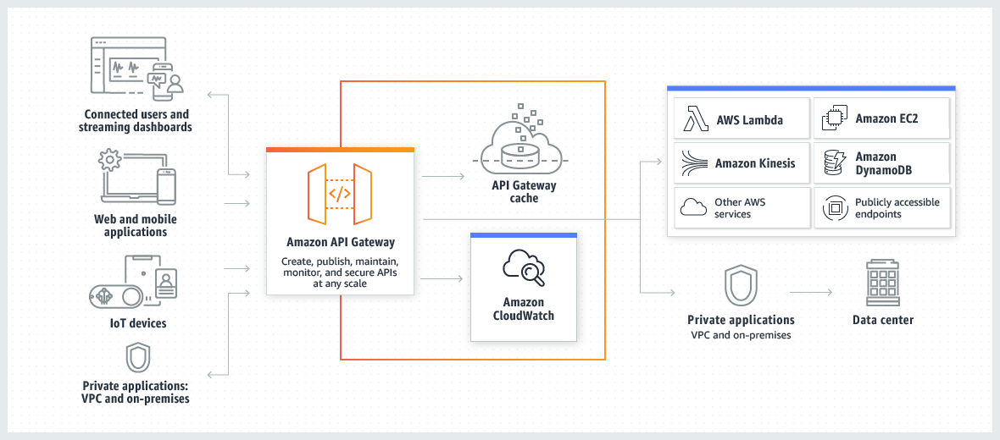

## ¿Qué es?

**Amazon API Gateway** es un servicio completamente gestionado que permite a los desarrolladores crear, publicar, mantener, monitorear y asegurar APIs REST, HTTP y WebSocket a cualquier escala. Actúa como una "puerta de entrada" entre aplicaciones cliente y servicios backend, gestionando todo el ciclo de vida de las APIs incluyendo autenticación, autorización, throttling, monitoreo y versionado.



**Diagrama:**

```
[Cliente] → [CloudFront/Edge] → [API Gateway] → [Integración Backend]
                                      ↓              ↓
                                 [Autorización]  [Lambda/EC2/HTTP/AWS Services]
                                      ↓              ↓
                             [Throttling/Cache] → [Respuesta transformada]
                                      ↓              ↓
                              [CloudWatch Logs] ← [Cliente]
```

## Escenarios de uso

- **APIs para aplicaciones serverless** - Frontal para funciones Lambda en arquitecturas sin servidor
- **Microservicios gateway** - Punto único de entrada para múltiples microservicios
- **APIs móviles y web** - Backend unificado para aplicaciones móviles y web
- **Integración de sistemas legacy** - Modernización de APIs de sistemas existentes
- **APIs de terceros** - Proxy para servicios externos con transformación de datos
- **APIs en tiempo real** - WebSocket APIs para chat, gaming, notificaciones push
- **Monetización de datos** - APIs comerciales con control de acceso y facturación
- **Backend-as-a-Service (BaaS)** - Servicios backend para desarrollo rápido de aplicaciones

## Buenas prácticas

- **Usar HTTP APIs para nuevos proyectos** - Mejor performance y menor costo que REST APIs
- **Implementar versionado de APIs** - Estrategias de versionado para compatibilidad backward
- **Configurar throttling adecuado** - Proteger backends con rate limiting apropiado
- **Habilitar logging y monitoreo** - CloudWatch Logs, X-Ray tracing y métricas personalizadas
- **Usar custom domains** - Dominios propios para APIs de producción
- **Implementar CORS correctamente** - Configurar Cross-Origin Resource Sharing para browsers
- **Validar requests en el gateway** - Reducir carga en backend validando en API Gateway
- **Usar stages para entornos** - Separar dev, staging y production con stages

## Aspectos a configurar

- **Tipo de API** - REST, HTTP, o WebSocket según necesidades específicas
- **Métodos HTTP** - GET, POST, PUT, DELETE, PATCH y configuración de recursos
- **Integración backend** - Lambda, HTTP endpoints, AWS services o Mock
- **Autorización** - IAM, Cognito User Pools, Lambda Authorizers, API Keys
- **Stages y deployments** - Ambientes separados con configuraciones específicas
- **Throttling y rate limiting** - Límites por segundo y burst capacity
- **CORS configuration** - Headers permitidos para acceso desde browsers
- **Request/Response transformation** - Mapeo de parámetros y transformación de payload

## Versiones/Variantes del servicio

| Tipo de API             | Caso de uso                       | Características                                                     |
| ----------------------- | --------------------------------- | ------------------------------------------------------------------- |
| **HTTP APIs**           | APIs modernas, alta performance   | Menor latencia (60%), menor costo (70%), JWT nativo, OIDC           |
| **REST APIs**           | APIs enterprise, máximas features | API keys, caching, request validation, WAF, private endpoints       |
| **WebSocket APIs**      | Comunicación bidireccional        | Real-time messaging, persistent connections, stateful communication |
| **Private APIs**        | APIs internas VPC                 | Acceso desde VPC únicamente, sin internet, alta seguridad           |
| **Edge-optimized APIs** | APIs globales                     | CloudFront distribution, reducción de latencia global               |
| **Regional APIs**       | APIs regionales                   | Mejor para tráfico regional, control de latencia                    |

## Modelo de precios y facturación

- **Método de cobro:** Por número de llamadas API, transferencia de datos y características adicionales
- **Opciones de pricing:**
  - **HTTP APIs:** $1.00 por millón de requests
  - **REST APIs:** $3.50 por millón de requests
  - **WebSocket APIs:** $1.00 por millón de messages + $0.25 por millón de connection minutes
  - **Caching:** $0.02/hora por GB cached
  - **Data transfer:** $0.09 por GB (salida)
- **Costos típicos:** Desde $1/millón requests (HTTP) hasta $3.50/millón (REST)
- **Free Tier:** 1M API calls REST, 1M HTTP calls, 1M WebSocket messages por 12 meses

## Integración con otros servicios AWS

- **Servicios comunes:**
  - **Lambda** - Ejecución de código sin servidor para lógica de negocio
  - **Cognito** - Autenticación y autorización de usuarios
  - **CloudWatch** - Logging, métricas y alarmas de monitoreo
  - **WAF** - Protección contra ataques web comunes
  - **CloudFront** - CDN para distribución global de APIs
  - **VPC** - Conexión privada a recursos en Virtual Private Cloud
- **Patrones arquitecturales:**
  - Serverless: API Gateway + Lambda + DynamoDB
  - Microservices: API Gateway + ECS/EKS + RDS
  - Hybrid: API Gateway + Lambda + On-premises via VPN
- **Dependencias:** IAM roles/policies (obligatorio), Certificate Manager para HTTPS custom domains

## Límites y cuotas

- **Límites por defecto:**
  - 10,000 RPS por cuenta por región (throttle account-level)
  - 5,000 burst capacity adicional
  - 500 APIs REST por cuenta
  - 300 recursos por API REST
  - 10MB payload size máximo
- **Límites aumentables:** Account-level throttling quota via Service Quotas
- **Consideraciones de escalabilidad:**
  - Timeout máximo 29 segundos para integración
  - 6MB response payload limit para Lambda proxy integration
  - WebSocket connection limit: 100,000 concurrent connections

## Seguridad y compliance

- **Modelo de responsabilidad:**
  - **AWS:** Infraestructura del servicio, disponibilidad, patching del servicio
  - **Cliente:** Configuración de autenticación/autorización, cifrado de datos, access control
- **Opciones de cifrado:**
  - TLS 1.2 in-transit (obligatorio)
  - Certificate Manager para custom domains
  - mTLS (mutual TLS) para autenticación de certificados cliente
- **Certificaciones:** SOC, PCI DSS, HIPAA eligibility, ISO 27001, FedRAMP
- **Control de acceso:**
  - IAM policies para control de acceso a APIs
  - Resource policies para cross-account access
  - API Keys para identificación de clientes
  - Lambda Authorizers para lógica de autorización custom
  - Cognito integration para OAuth2/OIDC

## Monitoreo y troubleshooting

- **CloudWatch metrics:**
  - Count (número de requests), Latency, IntegrationLatency
  - 4XXError, 5XXError rates, CacheHitCount, CacheMissCount
  - ThrottledRequests para monitoreo de rate limiting
- **Logs generados:**
  - CloudWatch Logs para access logs y execution logs
  - X-Ray traces para request tracing detallado
  - VPC Flow Logs si se usan VPC integrations
- **CloudTrail events:**
  - CreateRestApi, UpdateRestApi, CreateDeployment
  - PutMethod, PutIntegration para cambios de configuración
- **Herramientas de diagnóstico:**
  - API Gateway Test console para pruebas inline
  - CloudWatch Insights para análisis de logs
  - X-Ray service map para visualización de dependencias

## Disponibilidad y durabilidad

- **SLA:** 99.95% de disponibilidad mensual para APIs regionales
- **Durabilidad:** N/A (servicio stateless, durabilidad depende del backend)
- **Opciones de redundancia:**
  - **Multi-AZ automático:** API Gateway se despliega automáticamente en múltiples AZ
  - **Multi-Region:** Para disaster recovery global
  - **Edge locations:** CloudFront para distribución global (edge-optimized)
- **Backup/Restore:**
  - Stage snapshots para rollback de deployments
  - CloudFormation/Terraform para Infrastructure as Code
  - API export/import para migración y backup de configuraciones

## Casos de uso: Correcto vs Incorrecto

### ✅ Cuándo SÍ usar API Gateway:

- **APIs públicas con autenticación** - Control de acceso, rate limiting, monitoreo centralizado
- **Arquitecturas serverless** - Frontend perfecto para funciones Lambda
- **Consolidación de microservicios** - Single endpoint para múltiples servicios backend
- **APIs con transformación de datos** - Request/response mapping y validation
- **APIs con requerimientos de caching** - Reducir latencia y carga en backend
- **Integración con servicios AWS** - Proxy directo a S3, DynamoDB, SQS, etc.

### ❌ Cuándo NO usar API Gateway:

- **APIs simples internas sin autenticación** → **Alternativa:** Application Load Balancer para routing HTTP básico
- **Alto throughput con latencia ultra-baja** → **Alternativa:** Direct Lambda invocation o ECS/EKS con ALB
- **WebSocket con lógica compleja de routing** → **Alternativa:** Custom WebSocket server en ECS/EC2
- **APIs con payloads muy grandes (>10MB)** → **Alternativa:** Direct S3 upload con presigned URLs
- **Streaming de datos en tiempo real** → **Alternativa:** Kinesis Data Streams o AppSync para GraphQL subscriptions
- **APIs gRPC nativas** → **Alternativa:** Application Load Balancer con gRPC support o EKS service mesh
- **Ultra-high frequency trading APIs** → **Alternativa:** Custom TCP/UDP solutions en EC2 bare metal
