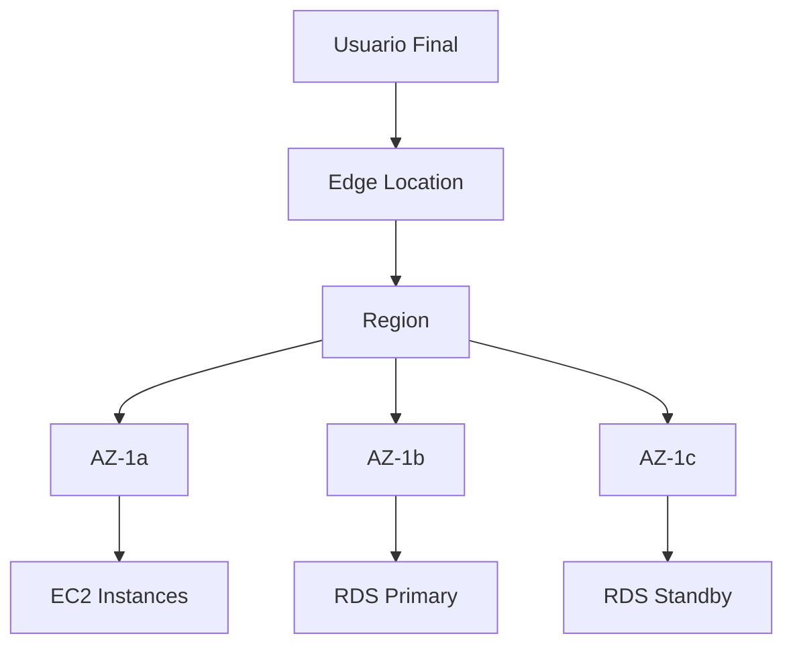

> **📂 Categoría:** Fundamentos | **🏷️ Tags:** #aws #infrastructure #regions #availability-zones  
> **📅 Creado:** 2025-06-27 | **🔄 Actualizado:** 2025-06-27  
> **📈 Nivel:** Básico | **💰 Pricing Tier:** N/A (Conceptual)

---

## 📋 Descripción General

**¿Qué es?**  
La infraestructura global de AWS es la red física de centros de datos distribuidos geográficamente alrededor del mundo que permite a AWS ofrecer servicios en la nube con alta disponibilidad, baja latencia y redundancia geográfica.

**¿Para qué sirve?**  
Proporciona la base física para todos los servicios de AWS, permitiendo desplegar aplicaciones cerca de los **usuarios finales**, cumplir con regulaciones de soberanía de datos, y diseñar arquitecturas resilientes contra desastres naturales o fallas regionales.

**¿Dónde encaja en AWS?**  
Es el fundamento de toda la plataforma AWS. Todos los servicios se ejecutan dentro de esta infraestructura y las decisiones arquitectónicas dependen de comprender sus componentes.

---

## ⚙️ Cómo Funciona / Arquitectura

### 🏗️ Componentes Principales

- **Regiones (Regions):** Áreas geográficas con múltiples centros de datos aislados
- **Zonas de Disponibilidad (AZ):** Centros de datos individuales dentro de una región
- **Edge Locations:** Puntos de presencia para CloudFront y otros servicios de edge
- **Local Zones:** Extensiones de regiones AWS en áreas metropolitanas específicas
- **Wavelength Zones:** Infraestructura AWS en redes 5G de operadores móviles

### 🔄 Flujo de Trabajo



### 🎛️ Configuraciones Clave

| Parámetro      | Descripción             | Valores                    | Notas                                  |
| -------------- | ----------------------- | -------------------------- | -------------------------------------- |
| Region         | Ubicación geográfica    | us-east-1, eu-west-1, etc. | Elección impacta latencia y compliance |
| AZ             | Zona dentro de región   | us-east-1a, us-east-1b     | Mínimo 3 por región                    |
| Edge Locations | Puntos de presencia CDN | 400+ locations             | Para CloudFront y Route 53             |

---

## 🎯 Casos de Uso / Cuándo Usarlo

### ✅ Ideal Para:

- 📊 **Multi-Region Deployments:** Aplicaciones globales con usuarios distribuidos
- 🚀 **Disaster Recovery:** Backup y recuperación en diferentes regiones
- 💼 **Compliance:** Cumplir con regulaciones de residencia de datos (GDPR, etc.)

### ❌ No Recomendado Para:

- ⚠️ **Aplicaciones Simples:** Sobre-ingeniería para casos de uso básicos
- ⚠️ **Presupuestos Limitados:** Múltiples regiones incrementan costos

### 🏢 Ejemplos del Mundo Real

1. **E-commerce:** Tienda online con presencia en US, Europa y Asia, cada región con su propia infraestructura
2. **SaaS Applications:** Aplicación SaaS que replica datos en múltiples regiones para baja latencia
3. **Enterprise:** Banco con regulaciones que requieren datos en territorio nacional específico

---

## ⚖️ Pros y Contras

### ✅ Ventajas

- **✨ Alta Disponibilidad:** 99.99% SLA con arquitectura multi-AZ
- **🚀 Baja Latencia:** Selección de región cerca de usuarios finales
- **💰 Redundancia Geográfica:** Protección contra desastres naturales

### ❌ Desventajas

- **⚠️ Complejidad:** Gestión de múltiples regiones aumenta complejidad operacional
- **💸 Costos Adicionales:** Transferencia de datos entre regiones tiene costo
- **🔧 Consistencia de Datos:** Desafíos de sincronización entre regiones

### 🆚 Alternativas

|Servicio|Cuándo Elegir|Diferencias Clave|
|---|---|---|
|[[Azure Regions]]|Microsoft ecosystem|Menos regiones, integración Office 365|
|[[Google Cloud Regions]]|ML/AI workloads|Fortaleza en machine learning|

---

## 💰 Modelo de Precios

### 💳 Cómo se Cobra

- **Modelo:** No hay costo directo por usar la infraestructura
- **Free Tier:** Incluido en todos los servicios
- **Factores de Costo:** Transferencia de datos entre regiones ($0.02/GB), latencia de acceso

### 📊 Estimación de Costos

```
Transferencia Inter-Region: $0.02/GB
Transferencia Intra-Region: Gratis
Edge Locations: Incluido en CloudFront pricing
```

### 💡 Tips de Optimización

- 🔧 **Tip 1:** Mantener datos y compute en la misma región para evitar costos de transferencia
- 📉 **Tip 2:** Usar CloudFront para reducir latencia sin múltiples regiones

---

## 🧪 Configuración Práctica

### 🚀 Setup Básico

```bash
# Listar todas las regiones disponibles
aws ec2 describe-regions

# Configurar región por defecto
aws configure set region us-east-1

# Listar AZs en región actual
aws ec2 describe-availability-zones
```

### ⚙️ Configuración Avanzada

```json
{
  "PreferredRegions": [
    "us-east-1",
    "eu-west-1", 
    "ap-southeast-1"
  ],
  "MultiAZDeployment": true,
  "CrossRegionReplication": true
}
```

### 🐍 Código Python/Boto3

```python
import boto3

# Cliente EC2 para explorar regiones
ec2 = boto3.client('ec2')

# Obtener todas las regiones
regions = ec2.describe_regions()
for region in regions['Regions']:
    print(f"Region: {region['RegionName']} - {region['Endpoint']}")

# Obtener AZs en región específica
ec2_virginia = boto3.client('ec2', region_name='us-east-1')
azs = ec2_virginia.describe_availability_zones()
for az in azs['AvailabilityZones']:
    print(f"AZ: {az['ZoneName']} - State: {az['State']}")
```

### ☕ Integración con Java/Spring Boot

```java
// Configuración multi-región en Spring Boot
@Configuration
public class AWSRegionConfig {
    
    @Bean
    @Primary
    public AmazonEC2 ec2ClientPrimary() {
        return AmazonEC2ClientBuilder.standard()
            .withRegion(Regions.US_EAST_1)
            .build();
    }
    
    @Bean
    public AmazonEC2 ec2ClientSecondary() {
        return AmazonEC2ClientBuilder.standard()
            .withRegion(Regions.EU_WEST_1)
            .build();
    }
}
```

---

## 🔒 Seguridad y Mejores Prácticas

### 🛡️ Consideraciones de Seguridad

- **IAM Permissions:** Políticas específicas por región si es necesario
- **Encryption:** Encriptación en tránsito para transferencias inter-región
- **Network Security:** VPC peering o Transit Gateway para conectividad segura
- **Logging/Monitoring:** CloudTrail habilitado en todas las regiones utilizadas

### ✅ Best Practices

1. **📋 Distribución Multi-AZ:** Siempre desplegar recursos críticos en múltiples AZs
2. **🔧 Selección de Región:** Elegir región más cercana a usuarios principales
3. **📊 Compliance:** Verificar regulaciones locales antes de seleccionar región

### ⚠️ Errores Comunes

- **❌ Single AZ Deployment:** Desplegar todo en una sola AZ
    - **✅ Solución:** Usar al menos 2 AZs para alta disponibilidad
- **❌ Región Incorrecta:** Elegir región lejana a usuarios
    - **✅ Solución:** Medir latencia desde ubicación de usuarios finales

---

## 📊 Monitoring y Troubleshooting

### 📈 Métricas Clave (CloudWatch)

- **Service Health Dashboard:** Estado de servicios por región
- **Personal Health Dashboard:** Eventos que afectan tus recursos
- **CloudWatch Cross-Region:** Métricas agregadas de múltiples regiones

### 🚨 Alertas Recomendadas

```yaml
RegionHealthAlert:
  Metric: AWS/Health
  Threshold: Any service disruption
  Action: SNS notification

AZFailureAlert:
  Metric: Custom/AvailabilityZone
  Threshold: AZ marked as impaired
  Action: Auto-scaling to healthy AZs
```

### 🔍 Troubleshooting Common Issues

|Problema|Síntomas|Solución|
|---|---|---|
|Alta Latencia|Respuestas lentas|Verificar región seleccionada vs ubicación usuarios|
|AZ No Disponible|Errores de lanzamiento|Cambiar a AZ diferente en misma región|
|Límites de Servicio|Errores de cuota|Revisar límites por región en Service Quotas|

---

## 🎓 Para el Examen SAA-C03

### 🎯 Puntos Clave para Recordar

- **💡 Concepto Clave 1:** Cada región tiene mínimo 3 AZs, físicamente separadas
- **💡 Concepto Clave 2:** Edge Locations son para CloudFront/Route 53, no servicios compute
- **💡 Concepto Clave 3:** Transferencia entre regiones tiene costo, dentro de región es gratis

### ❓ Preguntas Típicas de Examen

1. **Q:** ¿Cuándo usarías múltiples regiones vs múltiples AZs? **A:** Múltiples AZs para alta disponibilidad, múltiples regiones para disaster recovery y compliance
    
2. **Q:** ¿Cuál es la diferencia entre Edge Location y Availability Zone? **A:** Edge Locations son para CDN/DNS, AZs son centros de datos completos para cualquier servicio
    

### 🧠 Nemotécnicos

- **Recordatorio 1:** "RAE" - Regions > AZs > Edge locations (en términos de capacidad de servicios)
- **Recordatorio 2:** "3 AZ minimum" - Cada región tiene al menos 3 zonas de disponibilidad
- **Recordatorio 3:** Son centros de datos pequeños utilizados para acercar ciertos servicios a los usuarios finales
- **Recordatorio 4:** CDN (Content Delivery Network/Red de Entrega de Contenido) es un sistema distribuido de servidores ubicados en múltiples puntos geográficos alrededor del mundo. Su objetivo es acelerar la entrega de contenido Web (Imágenes, Videos, CSS, Javascript y archivos estáticos) a los usuarios, reduciendo la distancia física entre ellos y el servidor
- **Recordatorio 4:** DNS (Domain Name System/Sistema de Nombres de Dominio) es un traductor de direcciones IP a lenguaje humano

---

## 🔗 Servicios Relacionados

### 🤝 Integra Bien Con

- [[Amazon VPC]] - _Redes privadas que pueden span múltiples AZs_
- [[Amazon Route 53]] - _DNS global que utiliza Edge Locations_
- [[AWS CloudFront]] - _CDN que se despliega en Edge Locations_

### ⚡ Arquitecturas Comunes

- [[Multi-AZ Deployment Pattern]]
- [[Cross-Region Disaster Recovery]]
- [[Global Load Balancing Architecture]]

---

## 📚 Recursos y Referencias

### 📖 Documentación Oficial

- [AWS Global Infrastructure](https://aws.amazon.com/about-aws/global-infrastructure/)
- [AWS Regions and Availability Zones](https://docs.aws.amazon.com/AWSEC2/latest/UserGuide/using-regions-availability-zones.html)
- [AWS Service Health Dashboard](https://status.aws.amazon.com/)

### 🎥 Videos y Tutoriales

- [AWS re:Invent - Global Infrastructure Deep Dive](https://www.youtube.com/watch?v=uj7Ting6U_Y)
- [Regions and AZs Explained](https://www.youtube.com/watch?v=hiKPPy584Mg)
- [Curso Udemy - Sección 2: AWS Global Infrastructure](https://udemy.com/)

### 📝 Blogs y Artículos

- [AWS Architecture Blog - Multi-Region](https://aws.amazon.com/blogs/architecture/tag/multi-region/)
- [How to Choose AWS Region](https://freedium.cfd/https://medium.com/enlear-academy/how-to-choose-an-aws-region-5c84bc8fad39)
- [AWS Global Infrastructure Whitepaper](https://d1.awsstatic.com/whitepapers/aws-overview.pdf)

### 🧪 Hands-on Labs

- [[Lab 01 - Exploring AWS Regions and AZs]]
- [AWS Workshop - Multi-Region Basics](https://workshops.aws/)
- [Qwiklabs - AWS Infrastructure Fundamentals](https://qwiklabs.com/)

---

## 📝 Mis Notas y Experiencias

### 💭 Aprendizajes Personales

- La elección de región es crítica desde el inicio del proyecto
- Edge Locations no son lo mismo que AZs - confusión común
- Siempre considerar regulaciones de datos al elegir región

### 🔧 Configuraciones Que Funcionaron

- us-east-1 para aplicaciones globales (más servicios disponibles)
- eu-west-1 para compliance GDPR en Europa
- Multi-AZ deployment desde el principio, aunque sea más caro

### ⚠️ Problemas Que Encontré

- Latencia alta por elegir región incorrecta inicialmente
- Costos inesperados por transferencia de datos entre regiones
- Algunos servicios no disponibles en todas las regiones

### 📊 Mi Uso en Proyectos

- **Proyecto 1:** E-commerce - us-east-1 principal, eu-west-1 para usuarios europeos
- **Proyecto 2:** SaaS B2B - Multi-AZ en us-east-1, backup en us-west-2

---

## ✅ Checklist de Dominio

### 📚 Nivel Básico

- [x] Entiendo qué es y para qué sirve
- [x] Conozco casos de uso principales
- [x] Puedo explicar arquitectura básica
- [x] Sé cuándo usarlo vs alternativas

### 🎯 Nivel Intermedio

- [x] Puedo configurarlo desde consola
- [x] Entiendo modelo de precios
- [x] Conozco best practices básicas
- [x] Puedo troubleshoot problemas comunes

### 🚀 Nivel Avanzado

- [ ] Puedo automatizar con CLI/API
- [ ] Implemento en código Java/Python
- [ ] Optimizo costos y performance
- [ ] Diseño arquitecturas complejas

---

**🎯 Estado de Aprendizaje:** 🟡 Terminado  
**📊 Confianza para Examen:** 7/10  
**📅 Próxima Revisión:** 2025-07-04