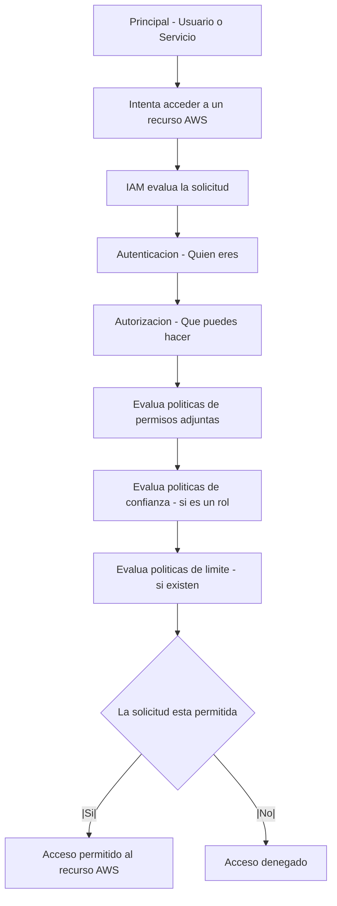

> **📂 Categoría:** Core | **🏷️ Tags:** #aws #core #iam #cli
> **📅 Creado:** 04/07/2025 | **🔄 Actualizado:** 04/07/2025  
> **📈 Nivel:** Basico | **💰 Pricing Tier:** N/A

## 📋 Descripción General

**¿Qué es?**
Es un servicio global de AWS, en donde IAM significa identidad y gestion de acceso.

**¿Para qué sirve?**  
Su función es controlar quien puede acceder a que recurso y bajo que condiciones.

**Funciones Principales**
- **Autenticación:** Verifica la identidad de usuarios y servicios
	- Gestión de credenciales (usuarios, contraseñas, claves de acceso)
	- Integración con proveedores de identidad externos (SAML, OpenID Connect)
- **Autorización:** Determinar que acciones pueden tomar los usuarios autenticados
	- Politicas granulares de permisos
	- Principio de menor privilegio
- **Gestión de identidades:** Crear y administrar diferentes tipos de identidades
	- Usuarios IAM
	- Grupos IAM
	- Roles IAM
	- Politicas IAM

**¿Dónde encaja en AWS?**
Es la base sobre la cual se construye el resto del entorno en la nube. Antes de que cualquier usuario, aplicación o servicio pueda interactuar con otros servicios AWS, primero debe de autenticarse a través de IAM.

---

## ⚙️ Cómo Funciona / Arquitectura

### 🏗️ Componentes Principales 
- **Usuarios (Users):** Representan a personas o aplicaciones que interactúan con AWS. Tienen credenciales de acceso (contraseña, claves de acceso).
- **Grupos (Groups):** Colecciones de usuarios de IAM. Permite asignar permisos a múltiples usuarios a la vez, simplificando la administración.
- **Roles (Roles):** Identidades de IAM que puedes asumir para obtener permisos temporales. Ideales para servicios de AWS, acceso entre cuentas o acceso temporal para usuarios.
- **Políticas (Policies):** Documentos JSON que definen los permisos. Se adjuntan a usuarios, grupos o roles para especificar qué acciones se permiten o deniegan en qué recursos.
* **Políticas Basadas en Identidad:** Adjuntas a usuarios, grupos o roles.
* **Políticas Basadas en Recursos:** Adjuntas directamente a un recurso (ej., un bucket S3) para controlar quién puede acceder a ese recurso.
- **Proveedores de Identidad (Identity Providers - IdP):** Permite la federación de identidades, integrando IAM con sistemas de identidad corporativos (ej., Microsoft Active Directory, Okta).

---

### 🔄 Flujo de Trabajo

---

## 🎛️ Configuraciones Clave

| **Parámetro** | **Descripción**                            | **Valores**                           | **Notas**                                                    |
| ------------- | ------------------------------------------ | ------------------------------------- | ------------------------------------------------------------ |
| Usuario IAM   | Identidad para personas/aplicaciones       | Nombre de usuario, credenciales       | Puede tener claves de acceso y contraseña                    |
| Grupo IAM     | Colección de usuarios                      | Nombre del grupo                      | Simplifica la gestión de permisos para múltiples usuarios    |
| Rol IAM       | Identidad asumible con permisos temporales | Nombre del rol, política de confianza | Ideal para servicios AWS y acceso entre cuentas              |
| Política IAM  | Documento JSON de permisos                 | Allow/Deny, Action, Resource          | Define qué acciones se permiten/deniegan en qué recursos     |
| MFA           | Autenticación Multifactor                  | Activado/Desactivado                  | Capa adicional de seguridad para usuarios IAM y usuario root |

--- 

## 🎯 Casos de Uso / Cuándo Usarlo

### ✅ Ideal Para:
- **Control de Acceso Granular:** Definir permisos específicos para usuarios y servicios
- **Delegación Segura:** Permitir que otros servicios de AWS (ej., EC2, Lambda) interactúen con otros servicios (ej., S3, DynamoDB) de forma segura
- **Acceso entre Cuentas:** Conceder acceso seguro a recursos en una cuenta AWS desde otra cuenta
- **Federación de identidades:** Integrar sistemas de identidad corporativos (ej., Active Directory) con AWS
- **Auditoria de accesos:** Registrar y monitorear quién puede acceder a qué recursos y cuándo (con CloudTrail)

### ❌ No Recomendado Para:
- **Compartir Credenciales Root:** Nunca se debe de compartir las credenciales de la cuenta root de AWS
- **Permisos Excesivos:** Otorgar permisos más amplios de los necesarios (violación del principio de privilegio mínimo)
- **Credenciales Permanentes para Servicios:** Usar claves de acceso de usuarios IAM directamente en aplicaciones en lugar de roles

### 🏢 Ejemplos del Mundo Real
1. **Desarrollo de Aplicaciones:** Un rol de IAM asignado a una instancia de EC2 que permite a la aplicación leer y escribir en un bucket de S3 especifico para almacenar imágenes
2. **Administrador de Bases de Datos:** Un usuario de IAM con una política que le permite gestionar bases de datos en Amazon RDS, pero sin acceso a recursos de red o de computo
3. **Auditor Externo:** Un rol de IAM temporal que un auditor externo puede asumir para acceder a registros de CloudTrail y métricas de CloudWatch en tu cuenta, sin acceso a datos sensibles

--- 

## ⚖️ Pros y Contras

### ✅ Ventajas

- **Seguridad Mejorada:** Implementa el principio de privilegio minimo, reduciendo la superficie de ataque
- **Flexibilidad:** Permite definir permisos muy granulares y complejos
- **Gratuito:** El servicio IAM no tiene costo adicional
- **Escalabilidad:** Fácil de gestionar identidades y accesos a medida que tu infraestructura crece
- **Integración Completa:** Se integra con todos los servicios de AWS y con proveedores de identidad externos

### ❌ Desventajas

- **Complejidad Inicial:** Puede ser abrumador para principiantes debido a la granularidad de las políticas
- **Costos Opcionales:** Características avanzadas como IAM Access Analyzer tienen costos asociados
- **Gestión de Políticas:** Mantener políticas claras y actualizadas puede ser un desafío en entornos grandes
- **Riesgo de Mala Configuración:** Una configuración incorrecta puede llevar a brechas de seguridad o a denegación de servicios

---

## 💰 Modelo de Precios

### 💳 Cómo se Cobra
- **Modelo:** AWS IAM es un servicio gratuito. No se cobra por crear usuarios, grupos, roles o políticas.
- **Free Tier:** Incluido como parte de la cuenta de AWS sin costo directo.
- **Factores de Costo:**  
  Los únicos costos asociados pueden provenir del uso de características avanzadas como **AWS IAM Access Analyzer**, que se cobra por la cantidad de recursos o identidades analizadas.

---

### 📊 Estimación de Costos

| Servicio                            | Costo estimado                               |
|-------------------------------------|----------------------------------------------|
| IAM (básico)                        | $0.00 / mes                                   |
| IAM Access Analyzer (ejemplo)       |                                              |
| - Análisis de recursos              | $9.00 / recurso analizado / mes / analizador |
| - Análisis de acceso no utilizado   | $0.20 / rol o usuario analizado / mes        |
| - Verificaciones de políticas       | $0.0020 / llamada a la API                   |

---

### 💡 Tips de Optimización

- 🔧 **Tip 1:** Utiliza el principio de **privilegio mínimo** para evitar permisos excesivos, lo que también puede reducir la superficie de ataque.
- 📉 **Tip 2:** Revisa regularmente las **políticas y los roles** para eliminar permisos innecesarios o no utilizados.
- 📊 **Tip 3:** Aprovecha **IAM Access Analyzer** para identificar accesos no deseados o permisos excesivos, invirtiendo en seguridad.
