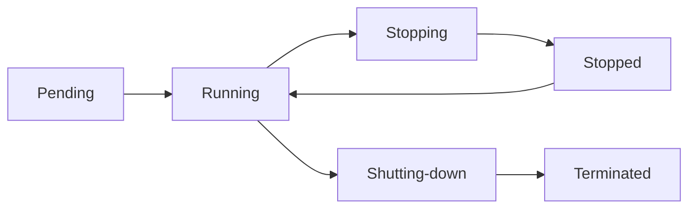

## 📋 Índice

1. [Introducción a Amazon EC2](https://claude.ai/chat/2ae6294d-0c47-49e7-a079-c689562d77ca#introducci%C3%B3n-a-amazon-ec2)
2. [Conceptos Fundamentales](https://claude.ai/chat/2ae6294d-0c47-49e7-a079-c689562d77ca#conceptos-fundamentales)
3. [Tipos de Instancias EC2](https://claude.ai/chat/2ae6294d-0c47-49e7-a079-c689562d77ca#tipos-de-instancias-ec2)
4. [Modelos de Precios](https://claude.ai/chat/2ae6294d-0c47-49e7-a079-c689562d77ca#modelos-de-precios)
5. [Lanzamiento de Instancias](https://claude.ai/chat/2ae6294d-0c47-49e7-a079-c689562d77ca#lanzamiento-de-instancias)
6. [Seguridad en EC2](https://claude.ai/chat/2ae6294d-0c47-49e7-a079-c689562d77ca#seguridad-en-ec2)
7. [Almacenamiento](https://claude.ai/chat/2ae6294d-0c47-49e7-a079-c689562d77ca#almacenamiento)
8. [Casos de Uso y Escenarios](https://claude.ai/chat/2ae6294d-0c47-49e7-a079-c689562d77ca#casos-de-uso-y-escenarios)
9. [Mejores Prácticas](https://claude.ai/chat/2ae6294d-0c47-49e7-a079-c689562d77ca#mejores-pr%C3%A1cticas)
10. [Administración y Monitoreo](https://claude.ai/chat/2ae6294d-0c47-49e7-a079-c689562d77ca#administraci%C3%B3n-y-monitoreo)

---

## 1. Introducción a Amazon EC2

### ¿Qué es Amazon EC2?

Amazon Elastic Compute Cloud (EC2) es un servicio web que proporciona capacidad de cómputo redimensionable en la nube. Es uno de los servicios más populares de AWS y permite a los usuarios crear y administrar servidores virtuales (instancias) en la infraestructura de AWS.

### Características Principales

- **Elasticidad**: Escala automáticamente hacia arriba o abajo según la demanda
- **Control completo**: Acceso root/administrativo a las instancias
- **Flexibilidad**: Múltiples tipos de instancia para diferentes casos de uso
- **Seguridad**: Integración con sistemas de seguridad robustos de AWS
- **Confiabilidad**: 99.95% de disponibilidad SLA

### Caso de Uso Real

**Netflix** utiliza miles de instancias EC2 para entregar contenido a millones de usuarios globalmente. Pueden escalar automáticamente durante las horas pico (como el estreno de una serie popular) y reducir recursos durante horas de menor demanda, optimizando costos.

---

## 2. Conceptos Fundamentales

### Terminología Clave

#### Instancia

Una instancia es esencialmente un servidor virtual que funciona en la infraestructura de AWS. Cada instancia tiene:

- CPU, memoria RAM, almacenamiento y capacidad de red dedicados
- Sistema operativo (Linux, Windows, macOS)
- Identificador único (Instance ID: i-1234567890abcdef0)

#### AMI (Amazon Machine Image)

Una AMI es una plantilla preconfigurada que contiene:

- Sistema operativo
- Software adicional
- Configuraciones específicas

**Ejemplo**: AMI de Amazon Linux 2 con servidor web Apache preinstalado.

#### Hypervisor

AWS utiliza dos tipos de hypervisores:

- **Nitro**: Hypervisor moderno para instancias actuales (mejor rendimiento)
- **Xen**: Para instancias de generaciones anteriores

### Estados de Instancia



- **Pending**: Instancia iniciándose
- **Running**: Instancia activa y funcional
- **Stopping**: Instancia deteniéndose
- **Stopped**: Instancia detenida (no se cobra compute, sí storage)
- **Terminated**: Instancia eliminada permanentemente

---

## 3. Tipos de Instancias EC2

### Familias de Instancias

#### General Purpose (Uso General)

**M5, M6i, T3, T4g**

- Balance entre compute, memoria y red
- Ideal para aplicaciones web, microservicios
- **Ejemplo**: Servidor web corporativo con tráfico moderado

#### Compute Optimized (Optimizadas para Cómputo)

**C5, C6i, C7g**

- Alto rendimiento de procesador
- Ideal para HPC, modelado científico, gaming
- **Ejemplo**: Servidor de juegos online que requiere baja latencia

#### Memory Optimized (Optimizadas para Memoria)

**R5, R6g, X1e, z1d**

- Gran cantidad de RAM
- Ideal para bases de datos en memoria, analytics
- **Ejemplo**: Base de datos SAP HANA con datasets masivos

#### Storage Optimized (Optimizadas para Almacenamiento)

**I3, D3, H1**

- Alto rendimiento de E/O secuencial
- Ideal para sistemas distribuidos, data warehousing
- **Ejemplo**: Cluster Elasticsearch para búsquedas en tiempo real

#### Accelerated Computing (Cómputo Acelerado)

**P4, G4, F1, Inf1**

- GPU, FPGA, o chips especializados
- Ideal para ML, renderizado, criptomonedas
- **Ejemplo**: Entrenamiento de modelos de deep learning

### Instancias Burstable (T3, T4g)

- **CPU Credits**: Sistema de créditos para manejar ráfagas de uso
- **Baseline Performance**: Rendimiento base garantizado (10-40% CPU)
- **Burst**: Puede usar hasta 100% CPU consumiendo créditos

**Escenario Real**: Blog personal que normalmente usa 5% CPU, pero puede necesitar 100% durante viral posts.

---

## 4. Modelos de Precios

### On-Demand Instances

**Características:**

- Pago por uso (por segundo, mínimo 60 segundos)
- Sin compromisos a largo plazo
- Ideal para cargas impredecibles

**Caso de Uso**: Startup que no puede predecir patrones de tráfico.

### Reserved Instances

**Características:**

- Descuento 40-60% vs On-Demand
- Compromiso de 1-3 años
- Opciones de pago: Todo adelantado, parcial, sin pago inicial

**Tipos:**

- **Standard**: No modificable, mayor descuento
- **Convertible**: Intercambiable por otros tipos, menor descuento

**Caso de Uso**: Servidor de base de datos principal con carga predecible.

### Spot Instances

**Características:**

- Hasta 90% descuento vs On-Demand
- Pueden ser interrumpidas con 2 minutos de aviso
- Basado en capacidad disponible

**Casos de Uso Ideales:**

- Procesamiento de big data
- Análisis científicos
- Tareas batch tolerantes a fallos

**Ejemplo**: Empresa farmacéutica procesando simulaciones moleculares que pueden pausarse y reanudarse.

### Dedicated Hosts

**Características:**

- Servidor físico dedicado completo
- Visibilidad de sockets, cores, host ID
- Para cumplimiento regulatorio o licencias específicas

### Savings Plans

- Descuentos hasta 72%
- Flexibilidad entre servicios (EC2, Fargate, Lambda)
- Compromiso de gasto por hora durante 1-3 años

---

## 5. Lanzamiento de Instancias

### Proceso Step-by-Step

#### 1. Selección de AMI

```bash
# AMIs comunes para Cloud Practitioner:
- Amazon Linux 2
- Ubuntu Server 20.04 LTS
- Windows Server 2019
- Red Hat Enterprise Linux 8
```

#### 2. Configuración de Instancia

- **Instance Type**: t3.micro (Free Tier eligible)
- **Number of Instances**: Cuántas instancias lanzar
- **Network**: VPC y subnet
- **Auto-assign Public IP**: Para acceso desde Internet

#### 3. Configuración de Storage

- **Root Volume**: Volume donde se instala el SO
- **Additional Volumes**: Volúmenes extra para datos
- **Volume Types**: gp3 (general), io2 (alto rendimiento)

#### 4. Security Groups

Firewall virtual que controla el tráfico:

```bash
# Regla SSH típica:
Type: SSH
Protocol: TCP
Port: 22
Source: 0.0.0.0/0 (¡No recomendado para producción!)

# Regla HTTP:
Type: HTTP
Protocol: TCP
Port: 80
Source: 0.0.0.0/0
```

#### 5. Key Pairs

Par de llaves criptográficas para acceso seguro:

- **Private Key**: Guardada por el usuario (.pem)
- **Public Key**: Almacenada en la instancia

### Tutorial Básico: Mi Primera Instancia EC2

#### Paso 1: Acceso al Console

1. Ir a https://console.aws.amazon.com/ec2/
2. Hacer clic en "Launch Instance"

#### Paso 2: Configuración Rápida

1. **Name**: "Mi-Primera-Instancia-EC2"
2. **AMI**: Amazon Linux 2023
3. **Instance Type**: t3.micro (Free Tier)
4. **Key Pair**: Crear nuevo o usar existente
5. **Security Group**: Allow SSH from My IP
6. Hacer clic en "Launch Instance"

#### Paso 3: Verificación

- Ver instancia en estado "Running"
- Conectar via SSH usando la private key

---

## 6. Seguridad en EC2

### Security Groups

**Características:**

- Firewall stateful (permite tráfico de retorno automáticamente)
- Solo reglas de ALLOW
- Aplica a nivel de instancia
- Cambios toman efecto inmediatamente

#### Mejores Prácticas Security Groups

1. **Principio de menor privilegio**: Solo puertos necesarios
2. **Source específico**: Evitar 0.0.0.0/0 cuando sea posible
3. **Separación por función**: Web tier, App tier, DB tier
4. **Nomenclatura clara**: "web-servers-sg", "database-sg"

### Network ACLs

**Características:**

- Firewall stateless (debe configurar entrada Y salida)
- Reglas de ALLOW y DENY
- Aplica a nivel de subnet
- Se evalúa antes que Security Groups

### Diagrama de Seguridad

```
Internet → Internet Gateway → Router → Network ACL → Security Group → EC2 Instance
```

### Caso de Uso: Aplicación Web de 3 Capas

```bash
# Web Tier Security Group:
- Inbound: HTTP (80), HTTPS (443) from 0.0.0.0/0
- Outbound: All traffic

# App Tier Security Group:
- Inbound: Port 8080 from Web Tier SG
- Outbound: All traffic

# Database Tier Security Group:
- Inbound: Port 3306 from App Tier SG
- Outbound: None needed
```

### IAM Roles para EC2

En lugar de hardcodear credenciales:

1. Crear IAM Role con permisos específicos
2. Asignar role a la instancia EC2
3. Aplicaciones usan SDK para asumir el role automáticamente

**Ejemplo**: Instancia EC2 que necesita acceso a S3:

```json
{
  "Version": "2012-10-17",
  "Statement": [
    {
      "Effect": "Allow",
      "Action": "s3:GetObject",
      "Resource": "arn:aws:s3:::mi-bucket/*"
    }
  ]
}
```

---

## 7. Almacenamiento

### Amazon EBS (Elastic Block Store)

#### Tipos de Volúmenes EBS

**gp3 (General Purpose SSD)**

- 3,000-16,000 IOPS base
- Hasta 1,000 MB/s throughput
- Mejor relación precio-rendimiento

**gp2 (General Purpose SSD)**

- 3 IOPS por GB (mínimo 100, máximo 16,000)
- Burst hasta 3,000 IOPS
- Burstable performance con créditos

**io2 (Provisioned IOPS SSD)**

- Hasta 64,000 IOPS
- 99.999% durabilidad
- Para bases de datos críticas

**st1 (Throughput Optimized HDD)**

- Hasta 500 MB/s
- Para big data, data warehouses
- No booteable

**sc1 (Cold HDD)**

- Hasta 250 MB/s
- Para acceso infrecuente
- Menor costo

### Instance Store

- Almacenamiento temporal de alto rendimiento
- Se pierde al detener/terminar instancia
- Ideal para caché, almacenamiento temporal

### Snapshots EBS

- Backup incremental a S3
- Punto en el tiempo
- Cross-region y cross-account

**Proceso de Snapshot:**

```bash
# Crear snapshot manual
aws ec2 create-snapshot --volume-id vol-12345678 --description "Backup diario"

# Snapshot automático via DLM (Data Lifecycle Manager)
# Configurar política de backup cada 24 horas, retener 7 días
```

---

## 8. Casos de Uso y Escenarios

### Escenario 1: Startup E-commerce

**Requerimientos:**

- Carga variable (Black Friday vs días normales)
- Presupuesto limitado
- Crecimiento rápido esperado

**Solución EC2:**

- **Instancias**: t3.micro/small con Auto Scaling
- **Precios**: On-Demand para flexibilidad inicial
- **Storage**: gp3 para base de datos
- **Security**: ALB + Security Groups restrictivos

### Escenario 2: Empresa Financiera

**Requerimientos:**

- Cumplimiento PCI DSS
- Alta disponibilidad 99.99%
- Cargas predecibles

**Solución EC2:**

- **Instancias**: Reserved Instances para ahorros
- **Deployment**: Multi-AZ con ELB
- **Security**: Dedicated Hosts para aislamiento
- **Backup**: Snapshots automáticos cada 4 horas

### Escenario 3: Investigación Científica

**Requerimientos:**

- Procesamiento intensivo esporádico
- Tolerancia a interrupciones
- Minimizar costos

**Solución EC2:**

- **Instancias**: Spot Instances con Spot Fleet
- **Tipos**: Compute optimized (c5.24xlarge)
- **Storage**: Instance Store para datos temporales
- **Orchestration**: AWS Batch para manejo de trabajos

### Escenario 4: Aplicación Global

**Requerimientos:**

- Usuarios en múltiples continentes
- Baja latencia
- Disaster recovery

**Solución EC2:**

- **Deployment**: Multi-Region
- **CDN**: CloudFront + S3 para contenido estático
- **Database**: RDS con Cross-Region replicas
- **DNS**: Route 53 con health checks

---

## 9. Mejores Prácticas

### Tagging Strategy

Implementar etiquetas consistentes para:

- **Environment**: prod, dev, test
- **Owner**: team-web, team-data
- **Cost-Center**: marketing, engineering
- **Project**: project-alpha, project-beta

```json
{
  "Tags": [
    {"Key": "Environment", "Value": "production"},
    {"Key": "Owner", "Value": "team-backend"},
    {"Key": "Application", "Value": "user-service"},
    {"Key": "Cost-Center", "Value": "engineering"}
  ]
}
```

### Right Sizing

1. **Monitoring inicial**: CloudWatch por 2-4 semanas
2. **Análisis métricas**: CPU, memoria, red, storage
3. **Ajuste gradual**: Cambiar instance type según datos
4. **AWS Compute Optimizer**: Recomendaciones automáticas

### Backup Strategy

```bash
# Estrategia 3-2-1:
# 3 copias de datos importantes
# 2 tipos de media diferentes  
# 1 copia offsite

# Implementación AWS:
- Producción: EBS volumes
- Backup local: EBS snapshots
- Backup remoto: Cross-region snapshots
```

### Security Hardening

1. **OS Updates**: Patch management automático
2. **Disable root login**: Solo key-based authentication
3. **Firewall**: iptables/Windows Firewall + Security Groups
4. **Monitoring**: CloudTrail + GuardDuty
5. **Encryption**: EBS encryption, encryption in transit

### Cost Optimization

1. **Reserved Instances**: Para cargas predecibles
2. **Spot Instances**: Para cargas tolerantes a fallos
3. **Auto Scaling**: Ajuste automático a demanda
4. **Scheduled scaling**: Scale up/down en horarios conocidos
5. **Instance hibernation**: Para development/testing

---

## 10. Administración y Monitoreo

### CloudWatch Metrics Clave

- **CPUUtilization**: Porcentaje de uso CPU
- **NetworkIn/Out**: Bytes de red entrada/salida
- **DiskReadOps/WriteOps**: Operaciones de disco
- **StatusCheckFailed**: Fallos de health checks

### CloudWatch Alarms

```bash
# Ejemplo: Alarma CPU alta
Metric: CPUUtilization
Threshold: > 80%
Period: 5 minutes
Evaluation: 2 out of 3 datapoints
Action: Send SNS notification + Auto Scaling
```

### AWS Systems Manager

**Session Manager**: Conexión segura sin SSH keys **Patch Manager**: Automatización de patches **Parameter Store**: Gestión de configuración **Systems Manager Agent**: Instalado por defecto en AMIs modernas

### Auto Scaling

```bash
# Configuración típica:
Min Size: 2 instances
Max Size: 10 instances
Desired: 2 instances

# Scaling Policies:
Scale Out: CPU > 70% por 5 minutos
Scale In: CPU < 30% por 10 minutos
```

### Elastic Load Balancing

- **ALB**: HTTP/HTTPS, Layer 7, path-based routing
- **NLB**: TCP/UDP, Layer 4, ultra-low latency
- **CLB**: Legacy, simple load balancing

---

## Resumen Ejecutivo para Cloud Practitioner

### Puntos Clave para el Examen

1. **EC2 = Compute virtual en la nube**
2. **Instance types**: General, Compute, Memory, Storage, GPU
3. **Pricing**: On-Demand, Reserved, Spot, Dedicated
4. **Security Groups = Firewall stateful**
5. **EBS = Block storage persistente**
6. **AMI = Template para launch instances**

### Casos de Uso Fundamentales

- **Web servers**: t3.micro/small + ALB
- **Databases**: Memory optimized + EBS io2
- **Big Data**: Spot instances + Instance store
- **HPC**: Compute optimized + Placement groups

### Cost Optimization Básico

- **Free Tier**: t2.micro/t3.micro 750 horas/mes
- **Reserved**: 40-60% descuento para cargas predecibles
- **Spot**: Hasta 90% descuento para cargas flexibles
- **Right sizing**: Monitorear y ajustar regularmente

---

## 🔗 Enlace para Cuestionarios Prácticos

Para practicar con preguntas específicas de EC2 para la certificación AWS Cloud Practitioner, utiliza este enlace:

**[Generar Cuestionario EC2 - AWS Cloud Practitioner](http://localhost:3000/quiz/ec2-cloud-practitioner)**

Este enlace te llevará a un cuestionario interactivo donde podrás:

- Practicar preguntas similares al examen real
- Recibir explicaciones detalladas de cada respuesta
- Identificar áreas que necesitan más estudio
- Simular la experiencia del examen oficial

---

_Esta guía cubre todos los aspectos de EC2 necesarios para aprobar la certificación AWS Cloud Practitioner. Estudia cada sección, practica con el cuestionario, y estarás bien preparado para el examen._