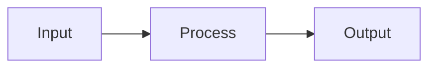

# ☁️ {{title}}

> **📂 Categoría:** {{category}} | **🏷️ Tags:** #aws #{{tag1}} #{{tag2}}  
> **📅 Creado:** {{date}} | **🔄 Actualizado:** {{date}}  
> **📈 Nivel:** {{level}} | **💰 Pricing Tier:** {{pricing}}

---

## 📋 Descripción General

<!-- Breve explicación del servicio/concepto y su propósito principal -->

**¿Qué es?**

**¿Para qué sirve?**

**¿Dónde encaja en AWS?**

---

## ⚙️ Cómo Funciona / Arquitectura

<!-- Profundiza en la mecánica o los principios detrás del concepto -->

### 🏗️ Componentes Principales

- **Componente 1:**
- **Componente 2:**
- **Componente 3:**

### 🔄 Flujo de Trabajo



### 🎛️ Configuraciones Clave

|Parámetro|Descripción|Valores|Notas|
|---|---|---|---|
|||||

---

## 🎯 Casos de Uso / Cuándo Usarlo

### ✅ Ideal Para:

- 📊 **Caso 1:**
- 🚀 **Caso 2:**
- 💼 **Caso 3:**

### ❌ No Recomendado Para:

- ⚠️ **Escenario 1:**
- ⚠️ **Escenario 2:**

### 🏢 Ejemplos del Mundo Real

1. **E-commerce:**
2. **SaaS Applications:**
3. **Enterprise:**

---

## ⚖️ Pros y Contras

### ✅ Ventajas

- **✨ Ventaja 1:**
- **🚀 Ventaja 2:**
- **💰 Ventaja 3:**

### ❌ Desventajas

- **⚠️ Limitación 1:**
- **💸 Limitación 2:**
- **🔧 Limitación 3:**

### 🆚 Alternativas

|Servicio|Cuándo Elegir|Diferencias Clave|
|---|---|---|
|[[Alternativa 1]]|||
|[[Alternativa 2]]|||

---

## 💰 Modelo de Precios

### 💳 Cómo se Cobra

- **Modelo:**
- **Free Tier:**
- **Factores de Costo:**

### 📊 Estimación de Costos

```
Escenario Básico: $X/mes
Escenario Medio: $X/mes  
Escenario Enterprise: $X/mes
```

### 💡 Tips de Optimización

- 🔧 **Tip 1:**
- 📉 **Tip 2:**

---

## 🧪 Configuración Práctica

### 🚀 Setup Básico

```bash
# Comandos CLI básicos
aws service-name create --parameter value
```

### ⚙️ Configuración Avanzada

```json
{
  "Configuration": {
    "parameter1": "value1",
    "parameter2": "value2"
  }
}
```

### 🐍 Código Python/Boto3

```python
import boto3

client = boto3.client('service-name')

# Ejemplo de uso
response = client.operation_name(
    Parameter1='value1',
    Parameter2='value2'
)
```

### ☕ Integración con Java/Spring Boot

```java
// Ejemplo con Spring Boot
@Service
public class AWSServiceIntegration {
    
    @Autowired
    private AmazonServiceClient client;
    
    public void performOperation() {
        // Implementación
    }
}
```

---

## 🔒 Seguridad y Mejores Prácticas

### 🛡️ Consideraciones de Seguridad

- **IAM Permissions:**
- **Encryption:**
- **Network Security:**
- **Logging/Monitoring:**

### ✅ Best Practices

1. **📋 Práctica 1:**
2. **🔧 Práctica 2:**
3. **📊 Práctica 3:**

### ⚠️ Errores Comunes

- **❌ Error 1:**
    - **✅ Solución:**
- **❌ Error 2:**
    - **✅ Solución:**

---

## 📊 Monitoring y Troubleshooting

### 📈 Métricas Clave (CloudWatch)

- **Métrica 1:**
- **Métrica 2:**
- **Métrica 3:**

### 🚨 Alertas Recomendadas

```yaml
Alert1:
  Metric: MetricName
  Threshold: Value
  Action: SNS Topic
```

### 🔍 Troubleshooting Common Issues

|Problema|Síntomas|Solución|
|---|---|---|
||||

---

## 🎓 Para el Examen SAA-C03

### 🎯 Puntos Clave para Recordar

- **💡 Concepto Clave 1:**
- **💡 Concepto Clave 2:**
- **💡 Concepto Clave 3:**

### ❓ Preguntas Típicas de Examen

1. **Q:** ¿Cuándo usarías este servicio vs alternativas? **A:**
    
2. **Q:** ¿Cuáles son las limitaciones principales? **A:**
    

### 🧠 Nemotécnicos

- **Recordatorio 1:**
- **Recordatorio 2:**

---

## 🔗 Servicios Relacionados

### 🤝 Integra Bien Con

- [[Servicio Complementario 1]] - _Razón_
- [[Servicio Complementario 2]] - _Razón_
- [[Servicio Complementario 3]] - _Razón_

### ⚡ Arquitecturas Comunes

- [[Patrón Arquitectónico 1]]
- [[Patrón Arquitectónico 2]]
- [[Caso de Uso Específico]]

---

## 📚 Recursos y Referencias

### 📖 Documentación Oficial

- [AWS Official Documentation](https://docs.aws.amazon.com/)
- [AWS Best Practices Guide](https://aws.amazon.com/whitepapers/)
- [Service Quotas](https://docs.aws.amazon.com/general/latest/gr/)

### 🎥 Videos y Tutoriales

- [AWS re:Invent Session](https://claude.ai/chat/8cf21cce-65a8-4ad0-883f-6786470f6c11)
- [YouTube Tutorial](https://claude.ai/chat/8cf21cce-65a8-4ad0-883f-6786470f6c11)
- [Curso Udemy - Timestamp](https://claude.ai/chat/8cf21cce-65a8-4ad0-883f-6786470f6c11)

### 📝 Blogs y Artículos

- [AWS Blog Post](https://claude.ai/chat/8cf21cce-65a8-4ad0-883f-6786470f6c11)
- [Community Article](https://claude.ai/chat/8cf21cce-65a8-4ad0-883f-6786470f6c11)
- [Medium/Dev.to Article](https://claude.ai/chat/8cf21cce-65a8-4ad0-883f-6786470f6c11)

### 🧪 Hands-on Labs

- [[Lab XX - Práctica Específica]]
- [AWS Workshop](https://claude.ai/chat/8cf21cce-65a8-4ad0-883f-6786470f6c11)
- [Qwiklabs Exercise](https://claude.ai/chat/8cf21cce-65a8-4ad0-883f-6786470f6c11)

---

## 📝 Mis Notas y Experiencias

### 💭 Aprendizajes Personales

<!-- Agrega tus propias observaciones aquí -->

### 🔧 Configuraciones Que Funcionaron

<!-- Documenta setups exitosos -->

### ⚠️ Problemas Que Encontré

<!-- Registra issues y sus soluciones -->

### 📊 Mi Uso en Proyectos

- **Proyecto 1:**
- **Proyecto 2:**

---

## ✅ Checklist de Dominio

### 📚 Nivel Básico

- [ ] Entiendo qué es y para qué sirve
- [ ] Conozco casos de uso principales
- [ ] Puedo explicar arquitectura básica
- [ ] Sé cuándo usarlo vs alternativas

### 🎯 Nivel Intermedio

- [ ] Puedo configurarlo desde consola
- [ ] Entiendo modelo de precios
- [ ] Conozco best practices básicas
- [ ] Puedo troubleshoot problemas comunes

### 🚀 Nivel Avanzado

- [ ] Puedo automatizar con CLI/API
- [ ] Implemento en código Java/Python
- [ ] Optimizo costos y performance
- [ ] Diseño arquitecturas complejas

---

**🎯 Estado de Aprendizaje:** 🔴 No iniciado | 🟡 En progreso | 🟢 Dominado  
**📊 Confianza para Examen:** ___/10  
**📅 Próxima Revisión:** {{date+7d}}